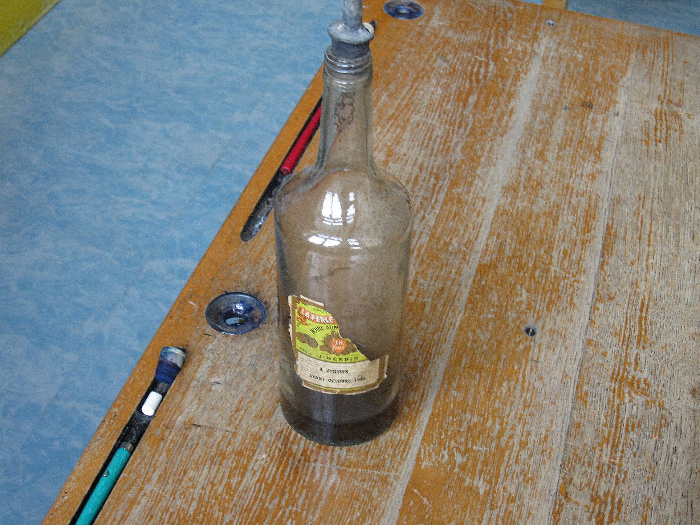
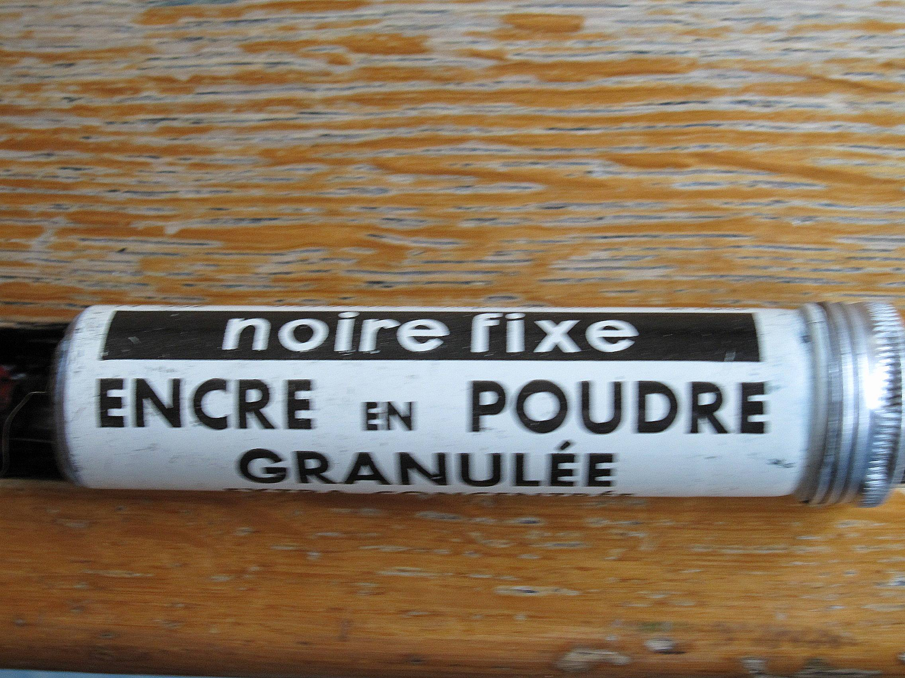
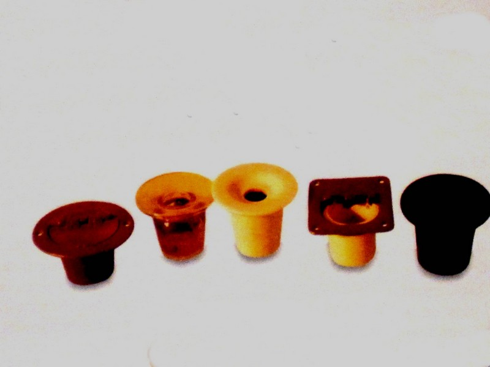
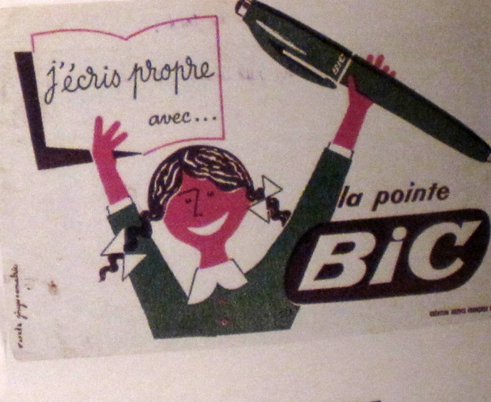

Combien de nous se souviennent-ils encore, dans leur enfance, avoir taché leurs
doigts à l'encre violette ? Cependant, il n'y a pas si longtemps que cette
coutume a disparu. Certes, dans mon enfance, voire dans les premiers postes que
j'ai occupés, on écrivait encore à l'encre. A l'automne 1968, préciserai-je, à
Paris, l'usage en était encore prescrit Pourtant mai et la mixité étaient passés
par là. Dans notre école parisienne du 20 ème arrondissement, le directeur, un
homme sévère, rigide et de haute taille, avait imposé, sur les tables en bois,
la pose d'une bande blanche dans la rainure cernant les encriers de porcelaine
blanche, afin de limiter les taches d'encre sur le bois de la table.

Lorsque l'encre allait manquer dans la classe, nous l'allions voir dans son
bureau et il nous conduisait dans le fameux local aux fournitures, véritable
caverne d'Ali Baba dont il gardait jalousement la clé. Il nous remettait alors
un, parfois deux cylindres de la taille d'un tube d'aspirine pour fabriquer
notre encre.

De retour en classe, un élève (lorsqu'il s'agissait de grandes classes : cours
moyen 1 ou 2) plutôt dégourdi et adroit, était chargé d'aller dans la cour avec
un litre vide prévu à cet effet et la cartouche d'encre qu'il vidait dans le
litre après avoir rempli d'eau celui-ci ; il secouait ensuite vigoureusement la
bouteille, telle la publicité d'orangina.

Il revenait en classe tout fiérot avec son litre d'encre et, après avoir fixé
sur le flacon d'encre un en-bout ad-hoc, l’élève de service remplissait
raisonnablement les petits récipients de porcelaine...

Et les plumes, « sergent major » pointues ou bien « gauloises » en forme de
losange (que nous préférions car elles faisaient mieux les pleins et les déliés)
pouvaient gratter le papier à loisir faire des calligraphies ou des « pâtés »
selon l'adresse de nos élèves.

Lorsque venait la fin du trimestre, notre cher directeur, impavide, faisait la
tournée des classes avec sa liasse de papier de verre, en vue de la toilette des
tables du lendemain. Certains élèves préféraient se faire porter « pâles » et
coupaient à la corvée mais tous les autres, fenêtres ouvertes, dans un
crissement et une poussière épouvantables, s'escrimaient pour redonner au bois
des précieuses tables leur pureté d'antan. Inspecteur des travaux, le directeur
venait admirer, sans mot dire, avec à peine un froncement de sourcil, le travail
achevé, demandant même parfois, une retouche supplémentaire.

C'était, comme le dit et le montre Doisneau, « le temps des doigts tachés
d'encre ». Quelques années plus tard, le danger des plumes, l'incommodité de
l'écriture et la facilité apportée par les nouveaux instruments épistolaires,
ont relégué porte-plumes et fioles d'encre violette au fond des placards. Adieu,
pleins et déliés et bonjour, la nostalgie, mais, j'ai toujours, dans mes
tiroirs, quelques flacons et des plumes en « ronde » pour faire mes titres et
amuser mes petits enfants.

