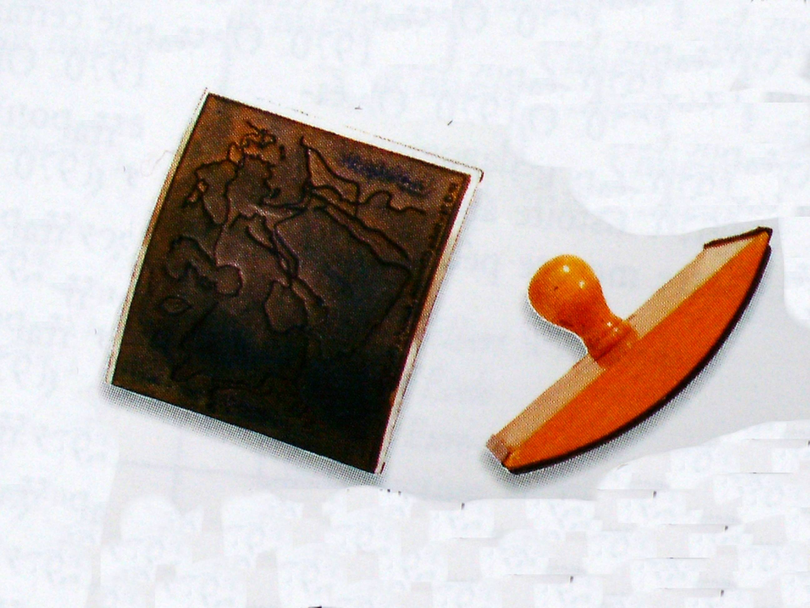
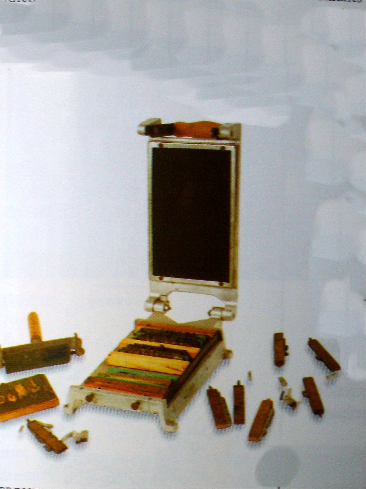
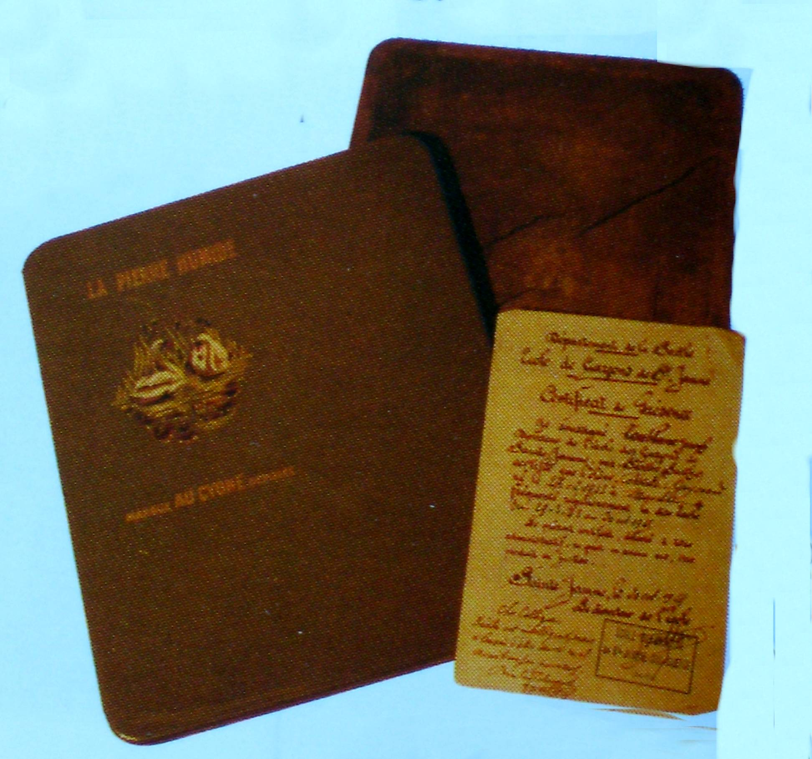
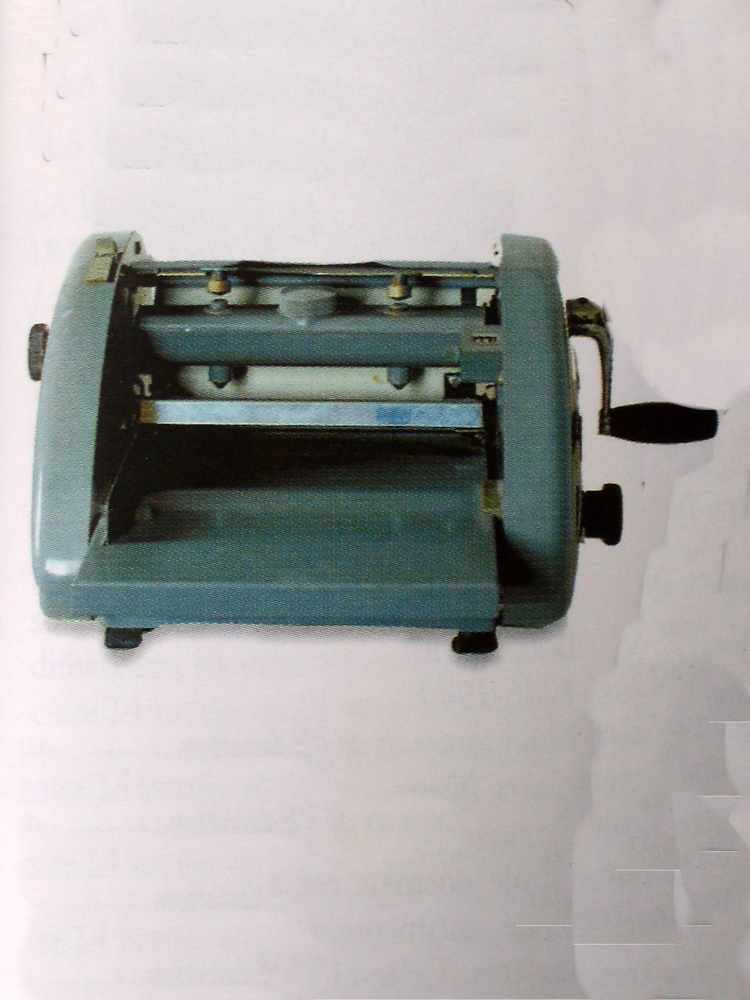

Qu'il s'agisse d'un croquis de leçons de choses, d'une carte de
géographie, ou d'une poésie, le maître a toujours eu besoin de remettre
à chacun de ses élèves le même document. Sans la photocopieuse,
reproduire en 30 ou 40 exemplaires un dessin ou un texte n'était pas
chose aisée.

Longtemps, on a utilisé le tampon encreur en caoutchouc qui permet de reproduire
des dessins, des mots, des chiffres, pour les classes de maternelle ou de cours
préparatoire et même, pour les plus grandes classes, des cartes de géographie.
Les collections de tampons sont souvent impressionnantes, quant au nombre. Le
« papier carbone » a été le moyen le plus souvent utilisé car cela ne
necessitait aucun matériel particulier si ce n'est la feuille de papier
recouverte sur une face d'une encre grasse solidifiée que l'on glissait entre la
première feuille et la seconde. En écrivant sur la première feuille, l'encre
grasse se déposait sur la seconde et l'on avait ainsi une nouvelle copie. Le
procédé avait ses limites et l'on ne pouvait faire que 2 ou 3 copies à la fois,
compte tenu de la pression qu'il fallait exercer sur la première feuille.
Obtenir une trentaine de copies exigeait une dizaine d'opérations semblables.
Les résultats étaient meilleurs avec l'utilisation d'une machine à écrire. Le
pédagogue Célestin Freinet qui crée le journal scolaire invente une presse à
imprimer pour réaliser ses publications.

Dans les années 1940 on voit apparaître un nouveau procédé de reprographie :
« la pierre humide ». Le matériel est constitué d'un cadre métallique ou en bois
contenant la pierre humide qui ressemble plus à une pâte solidifiée qu'à une
pierre.

Le maître dessine le document à reproduire sur une feuille de papier couché
spécial qui est ensuite appliqué, côté encre sur la pierre humide qui a été
humectée d'eau, d'où son nom. L'encre du papier couché laisse une trace sur la
pierre humide et l'on peut ainsi, en posant les feuilles de papier une à une sur
la pierre, reproduire le document original .

Dans les années 60 apparaît enfin la machine à polycopier à alcool. mécanique ou
électrique qui permet des tirages plus importants à condition de ne pas
« noyer » le carbone avec trop d'alcool.

Un bon nombre de ces petites machines à polycopier sont encore en fonctionnement
dans bien des classes. Depuis une quinzaine d'années, les écoles sont équipées
de photocopieuses parfaitement fonctionnelles mais dont l'entretien est coûteux,
d'autant plus que le nombre des photocopies remises aux élèves est parfois plus
important qu'il n'est nécessaire.
