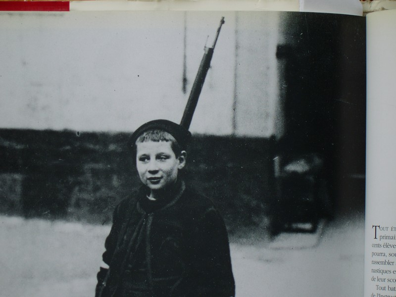
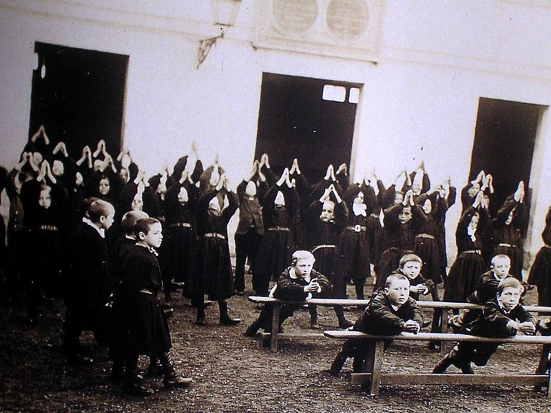
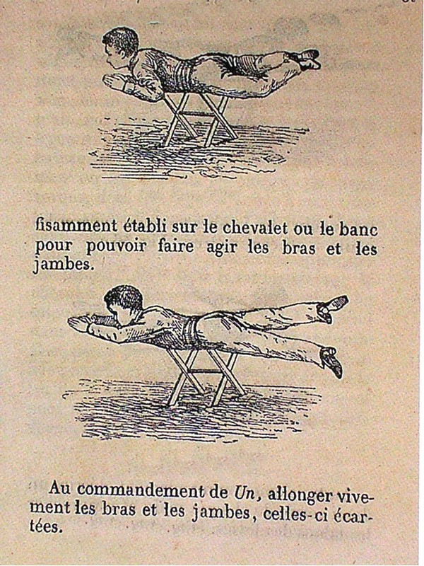
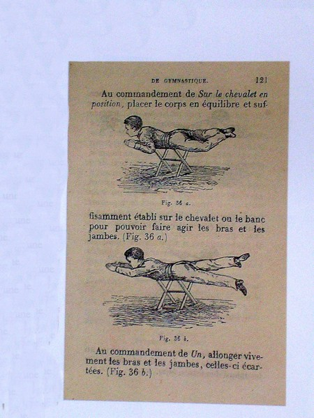
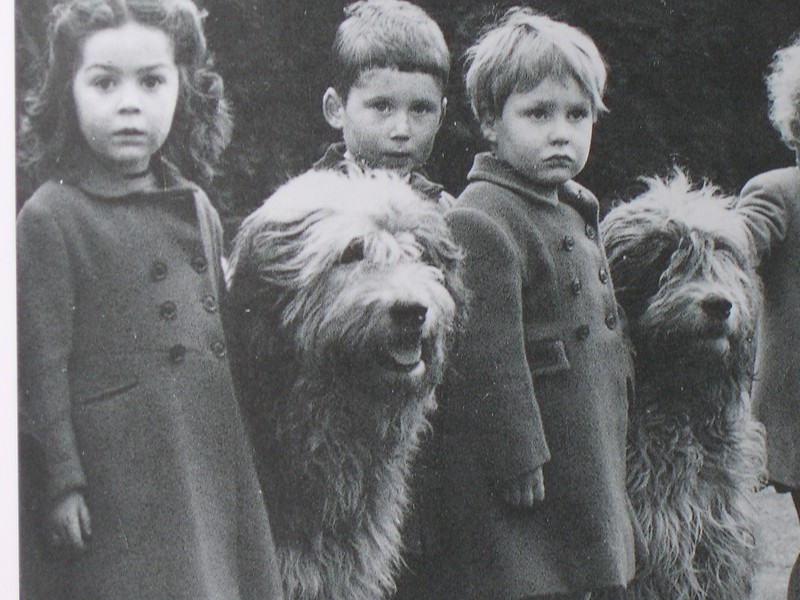
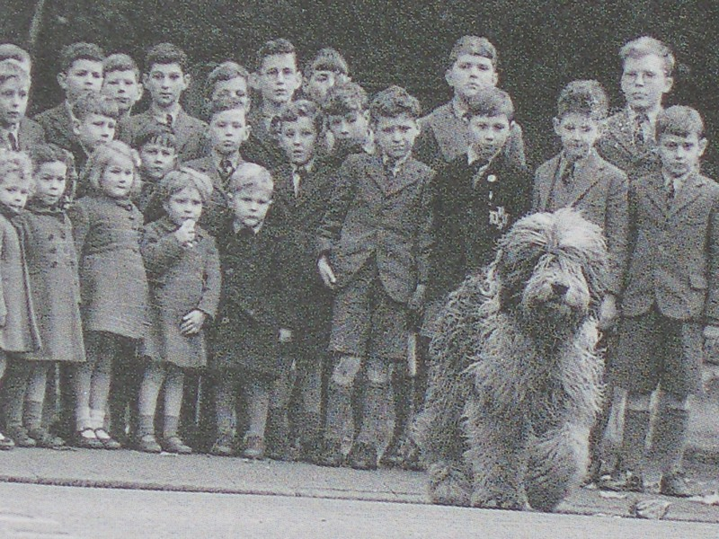
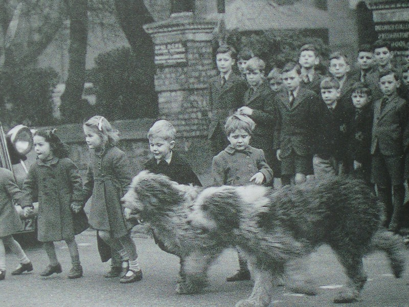

L'École s'est toujours attachée à s'ouvrir sur le monde extérieur et à permettre
aux enfants d'acquérir des savoirs ou des techniques qui n'étaient pas
spécifiquement scolaires mais plutôt en rapport avec l'esprit de la société de
l'époque et les moyens dont les maîtres disposaient. Avec le recul des années,
certains de ces apprentissages nous apparaissent tout à fait curieux.

## Préparer l'élève à être un bon soldat

De 1875 à 1914 on s'est attaché à donner aux jeunes garçons une sorte de
préparation militaire. Les élèves devaient apprendre à former des alignements
impeccables et à marcher au pas au son du tambour qui servait parfois, dans
quelques établissements, à indiquer le début des classes et la fin des
récréations.

J'ai retrouvé, dans le registre portatif d'une école parisienne (le registre
portatif était le livre dans lequel étaient répertoriés tous les matériels
existants dans l'école : tables, chaises, armoires, etc) l'indication de la
présence d'une carabine d'exercice destinée aux élèves. De nombreux
établissements possédaient un certain nombre de fusils en bois avec lesquels les
élèves s'exerçaient au maniement d'arme et aux défilés.

## Apprendre à nager

Vers les années 1880, les responsables de l'Instruction Publique avaient compris
l'importance de l'apprentissage de la natation dès le plus jeune âge. La tâche
n'était pas aisée car il fallait, d'une part, disposer du personnel qualifié
pour cet enseignement ( très nombreux étaient les maîtres qui ne savaient pas
nager ou qui n'étaient pas préparés pour conduire cet enseignement ) et d'autre
part, il fallait pouvoir disposer d'une piscine ou d'un bassin de natation, ce
qui était rarement le cas dans les petites ou les moyennes communes.

Qu'importe, les enseignants, jamais à court d'idées, préparaient les enfants à
la natation dans la cour de l'école ou dans la salle de classe :

pour ce faire, on utilisait des bancs sur lesquels les enfants s'allongeaient et
faisaient les mouvements d'un type de nage : essentiellement la brasse.

On espérait ainsi que, plongés dans l'élément liquide, les apprentis nageurs
retrouveraient l'automatisme des mouvements. Nous ne possédons, hélas, aucune
statistique permettant de juger les résultats de cet apprentissage .

## Autre méthode d'apprentissage curieuse : la sécurité dans la rue

Avec l'apparition de l'automobile et son développement, on a vite compris qu'il
était urgent d'apprendre aux enfants, surtout aux plus jeunes, à traverser les
rues sans prendre de risque. En Angleterre, dans les années 1920/1930 on a eu
recours à des moniteurs à quatre pattes. Des documents de l'époque nous montrent
des petits enfants (5 ou 6 ans) alignés au bord du trottoir et encadrés par deux
ou trois gros chiens.

Ces animaux formés à la sécurité, ne s'engageaient sur la chaussée que
lorsqu'ils avaient constaté qu'aucune voiture ne se présentait ni à gauche, ni à
droite.

Ils traversaient alors la voie suivis par les petits élèves.

Là encore, nulle statistique ne nous permet de savoir combien de chiens ont été
ainsi « éduqués » et on ne connaît pas non plus les résultats à la fin de cet
apprentissage.
