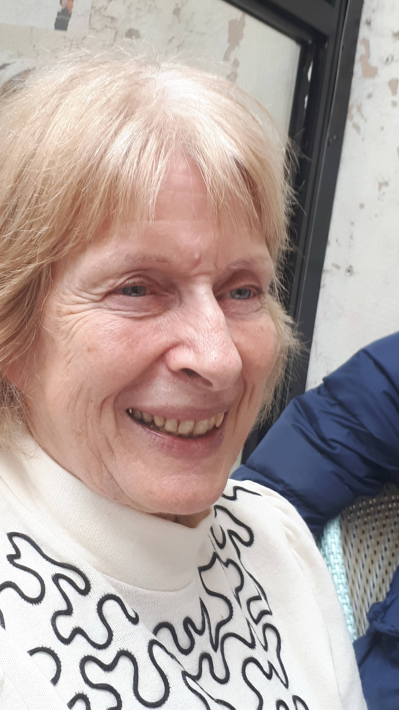
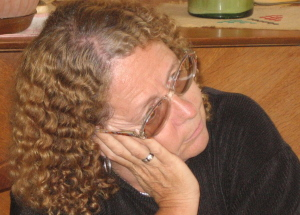
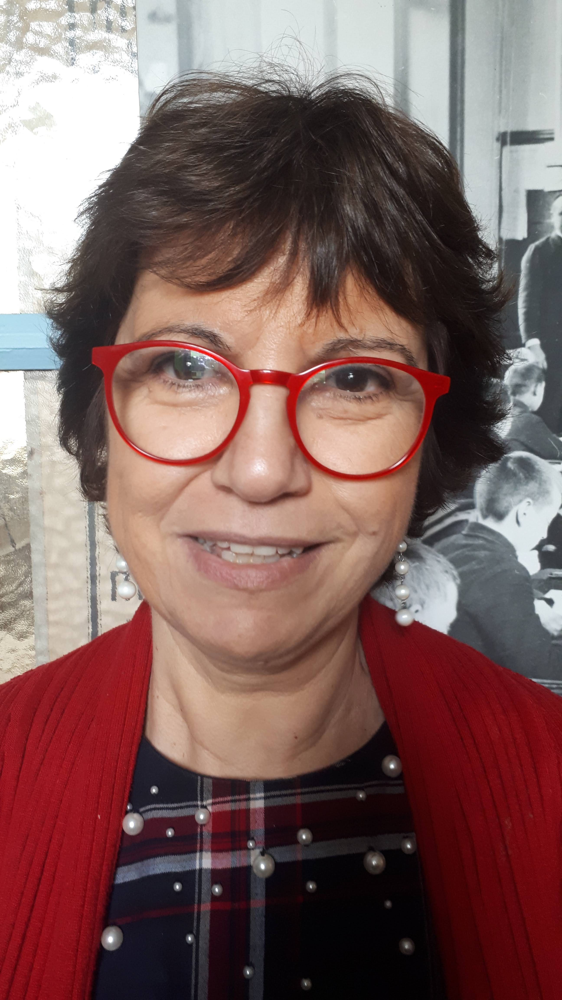
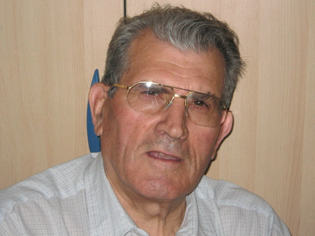
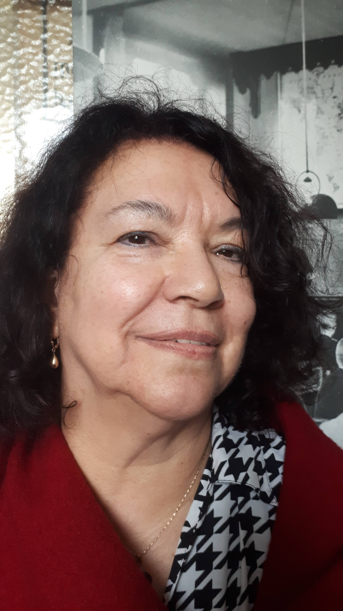
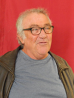
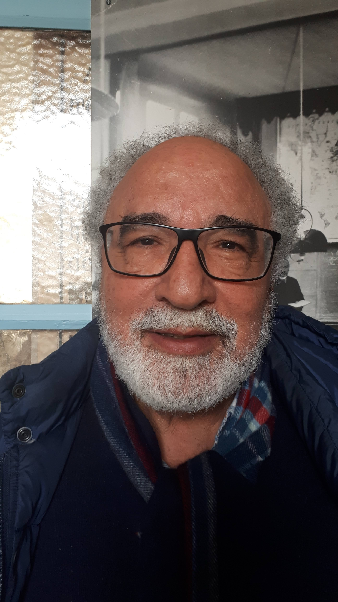
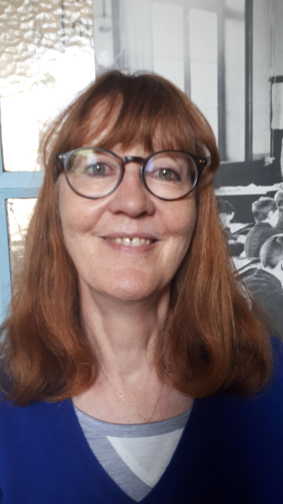
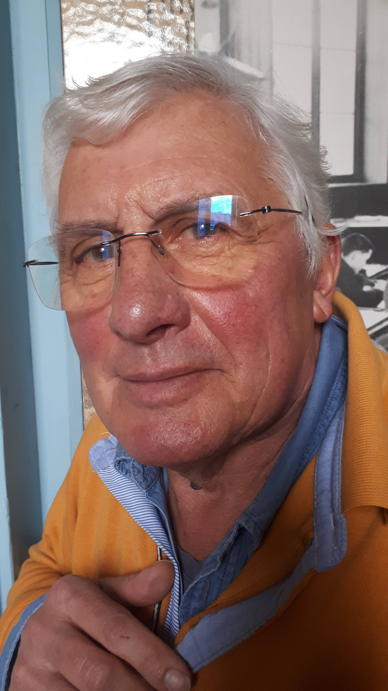
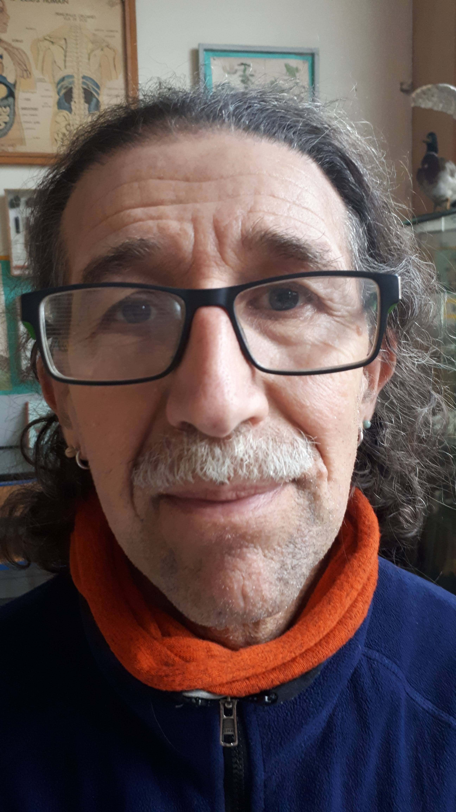

Une quinzaine de collègues, professeurs d'école retraités, se sont intéressés au
Musée. Ils ont installé les salles, collecté des objets anciens dans les écoles
de Paris et organisé les différentes vitrines de présentation.

Régulièrement, par équipes de deux, ils interviennent pour faire visiter le
Musée aux enfants venus en sortie pédagogique et leur font revivre la vie d'un
écolier de 1920 ou de 1950. Voici une présentation rapide des membres de notre
équipe :

### Madame Michelle Leprévost, présidente

### Monsieur Christian Leprévost, trésorier

### Madame Jocelyne Beffara, secrétaire

### Madame Hélène Amestoy

### Madame Marie-France Authier

### Monsieur Michel Jaulin

### Madame Danielle Josèphe

### Monsieur Jean-Paul Malek

### Monsieur Pierre Temim

### Madame Véronique Théfo

### Monsieur Philippe Thuillier

### Monsieur Franck Wambergue

Et merci aux anciens animateurs :
- Madame Danièle Albet
- Monsieur Jean Louis Albet
- Bernard Brajon
- Madame Anne Marie Charviat
- Patrice Crampon
- Monsieur Daniel Deboudt
- Monsieur Jean-Marie Demange
- Madame Arlette Jaulin
- Christiane Lasarte
- Marius Mouette
- Nicole Presse
- Jean-Jacques Simony
- Sylvie Sonnier

