Une quinzaine de collègues, professeurs d'école retraités, se sont intéressés au
Musée. Ils ont installé les salles, collecté des objets anciens dans les écoles
de Paris et organisé les différentes vitrines de présentation.

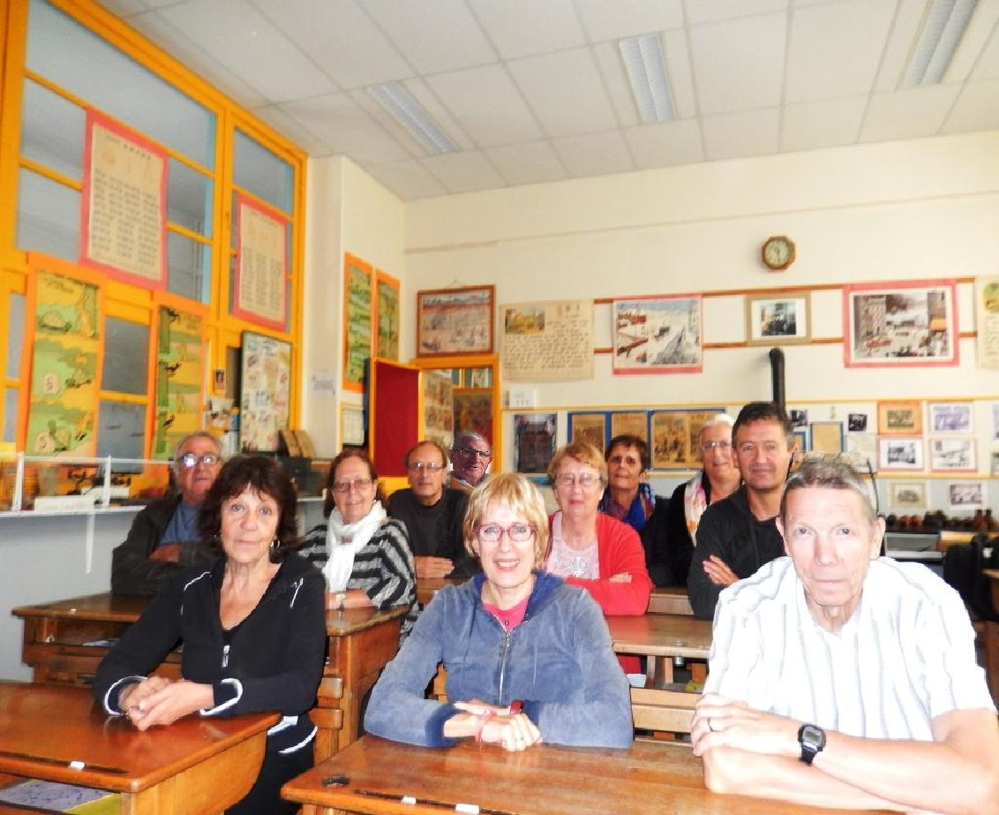

Régulièrement, par équipes de deux, ils interviennent pour faire visiter le
Musée aux enfants venus en sortie pédagogique et leur font revivre la vie d'un
écolier de 1920 ou de 1950. Voici une présentation rapide des membres de notre
équipe :

### Madame Marie-France Authier

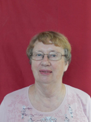

### Madame Jocelyne Beffara

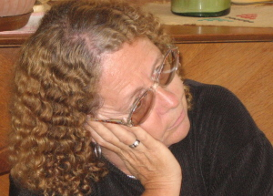

### Monsieur Bernard Brajon

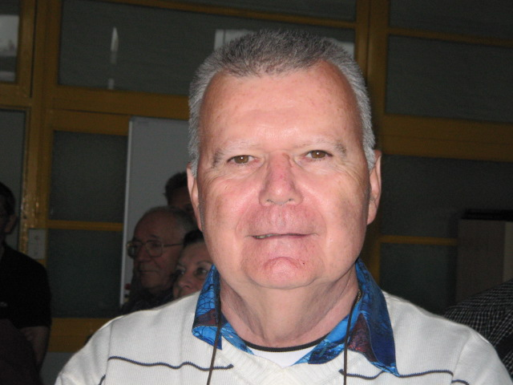

### Monsieur Patrice Crampon

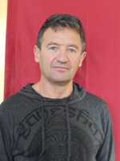

### Monsieur Michel Jaulin

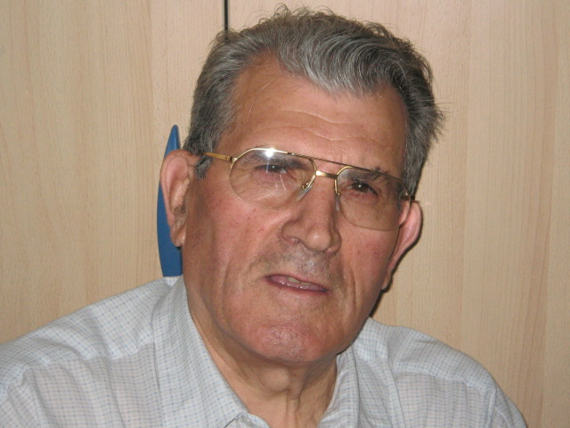

### Madame Christiane Lasarte

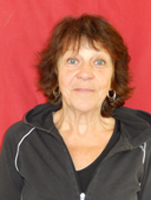

### Madame Michelle Leprévost

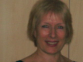

### Monsieur Christian Leprévost

### Monsieur Jean-Paul Malek

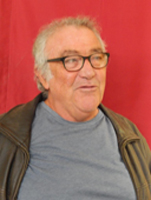

### Monsieur Marius Mouette

### Madame Nicole Presse

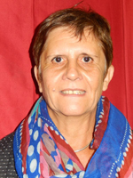

### Monsieur Jean Jacques Simony

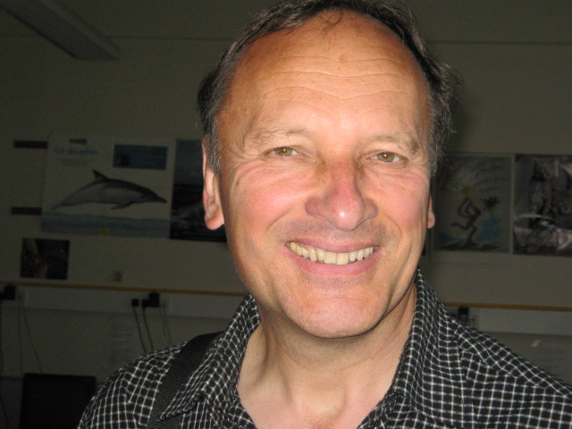

### Madame Sylvie Sonnier

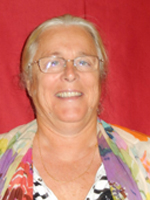

Et merci aux anciens animateurs :
- Madame Danièle Albet
- Monsieur Jean Louis Albet
- Madame Anne Marie Charviat
- Monsieur Daniel Deboudt
- Monsieur Jean-Marie Demange
- Madame Arlette Jaulin
