Une quinzaine de collègues, professeurs d'école retraités, se sont intéressés au
Musée. Ils ont installé les salles, collecté des objets anciens dans les écoles
de Paris et organisé les différentes vitrines de présentation.

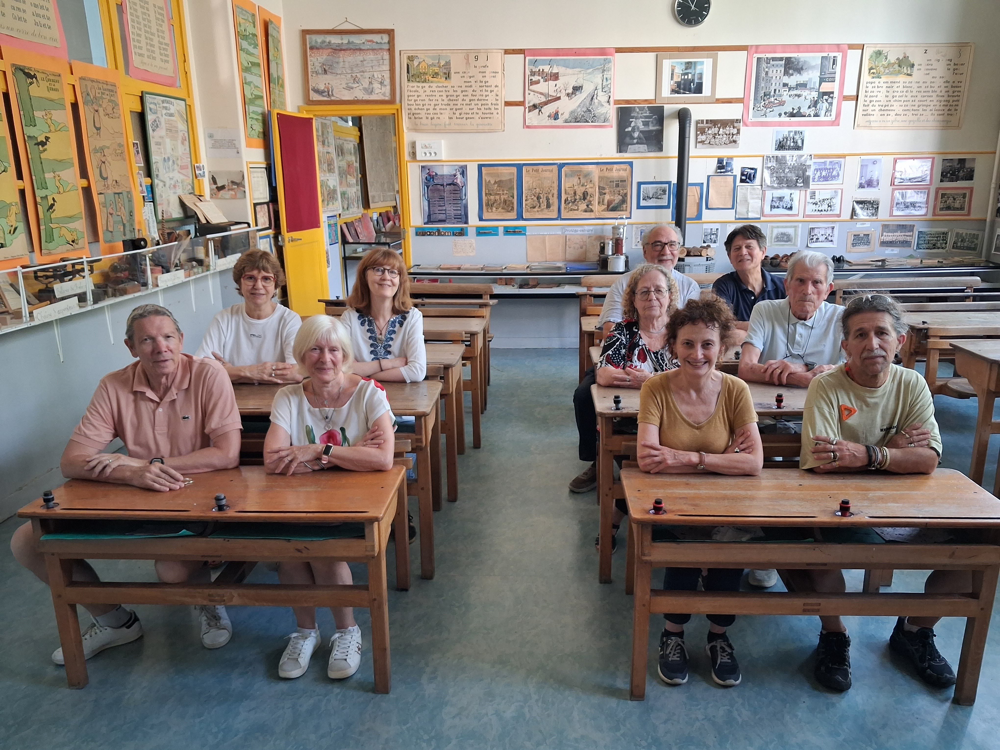

Régulièrement, par équipes de deux, ils interviennent pour faire visiter le
Musée aux enfants venus en sortie pédagogique et leur font revivre la vie d'un
écolier de 1920 ou de 1950. Voici une présentation rapide des membres de notre
équipe :

### Michelle Leprévost, présidente

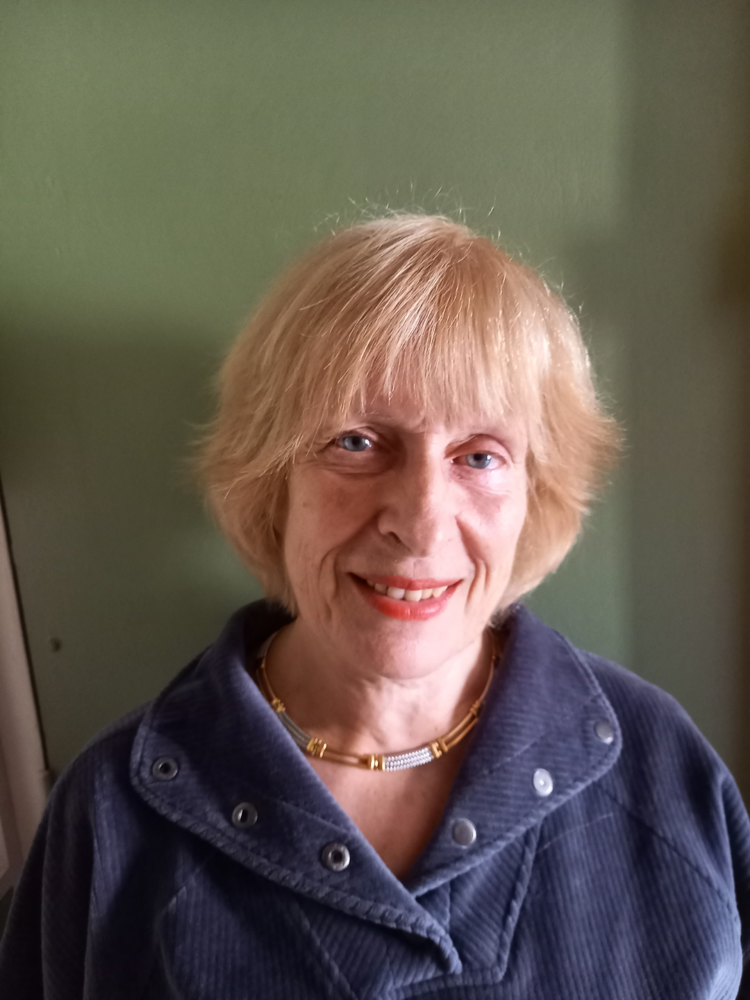

### Christian Leprévost, trésorier

### Véronique Théfo, secrétaire

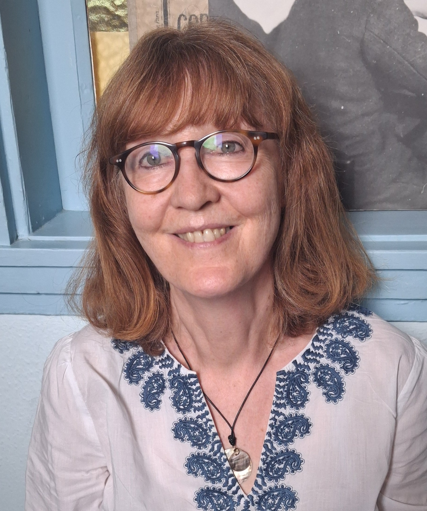

### Michel Jaulin, fondateur

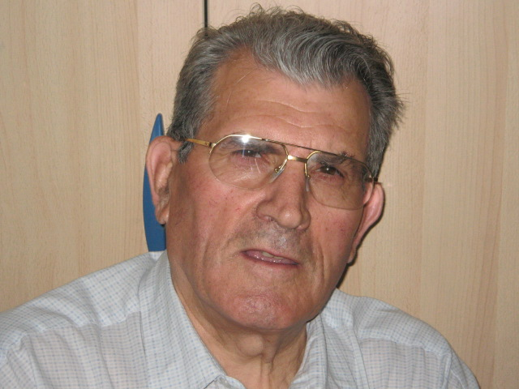

## Les autres animateurs et animatrices (par ordre alphabétique) :

### Hélène Amestoy

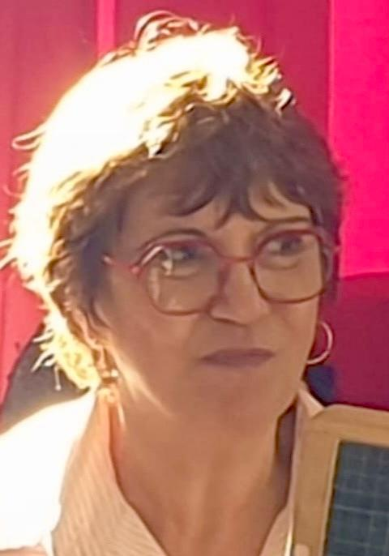

### Jocelyne Beffara

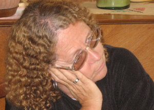

### Jean-Pierre Daneti

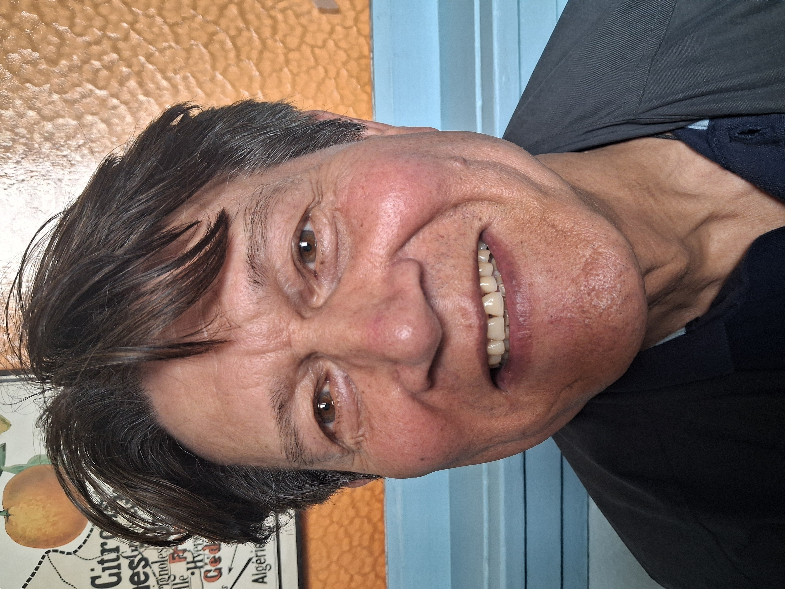

### Martine Gary

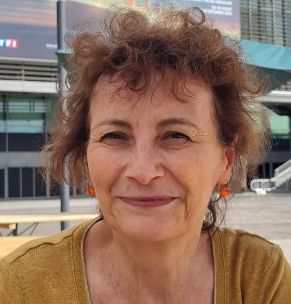

### Jean-Paul Malek

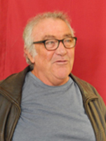

### Pierre Tenim

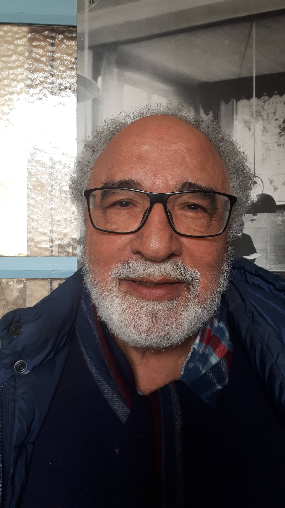

### Philippe Thuillier

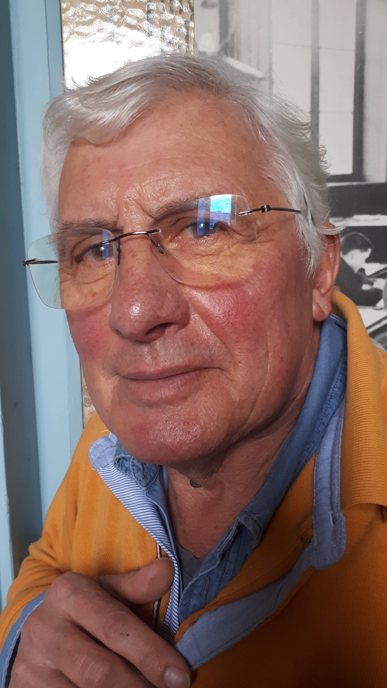

### Franck Wambergue

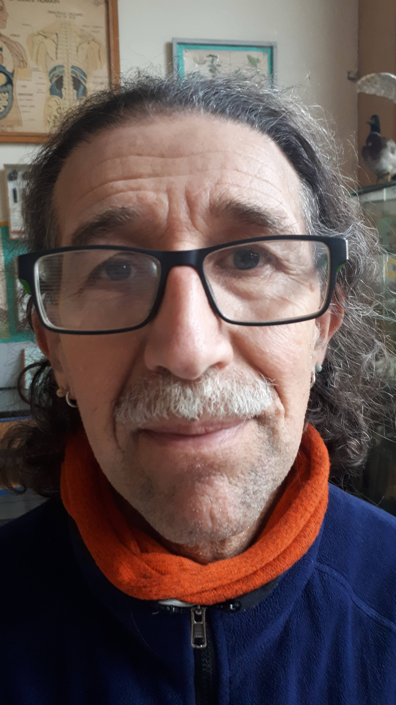

## Et merci aux anciens animateurs :

- Danièle Albet
- Jean Louis Albet
- Marie-France Authier
- Bernard Brajon
- Anne Marie Charviat
- Patrice Crampon
- Daniel Deboudt
- Jean-Marie Demange
- Arlette Jaulin
- Danielle Josèphe
- Christiane Lasarte
- Marius Mouette
- Nicole Presse
- Jean-Jacques Simony
- Sylvie Sonnier

