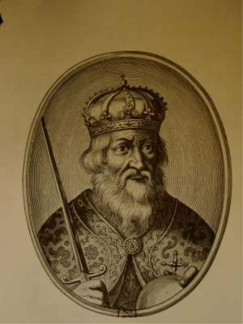
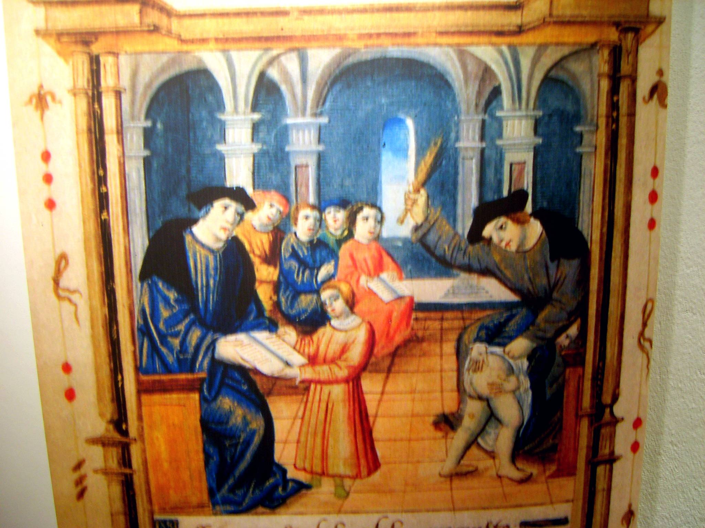
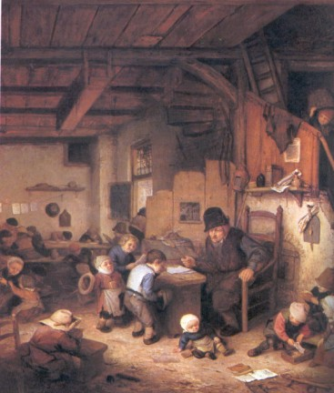
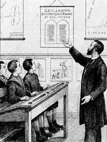
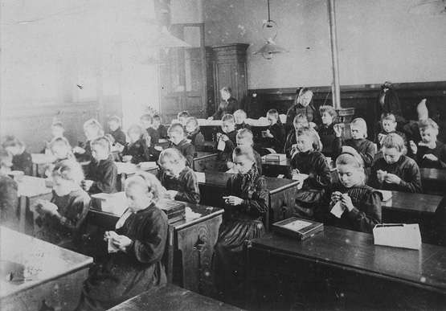
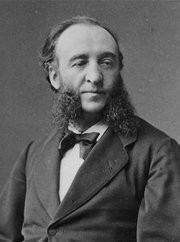

Contrairement à la croyance populaire qui voudrait que Charlemagne ait inventé
l'école, dès la plus haute antiquité, il y a eu des écoles publiques annexées
aux sanctuaires religieux, mais c'est lui qui a donné à l'école toute son
importance en mettant ensemble les enfants des nobles et les enfants des pauvres
destinés à l'étude et à l'église.

L'Eglise, au Moyen Age, joue un rôle primordial, rôle qui va perdurer pendant un
millénaire. Elle se trouve toutes les raisons du monde de s'arroger le droit
d'instruire la jeunesse .

Après le Concile de Trente (1563) certaines municipalités obligent les religieux
à entretenir des petites écoles municipales et publiques subventionnées par les
paroisses. Au 18ème siècle, Jean Baptiste de la Salle réussit à développer un
important réseau d'écoles primaires chrétiennes. A la veille de la Révolution,
les cahiers de doléances ne consacrent qu'une faible attention à l'école et le
problème scolaire va préoccuper les Etats Généraux. Chaque assemblée
révolutionnaire présente des plans d'éducation nationale.

L'éducation primaire passe sous la responsabilité de l'état : tous les enfants y
sont inscrits, même les filles.

Talleyrand demande déjà que l'école accueille gratuitement les enfants de 13 à
16 ans. La laïcité est formulée avec force par Condorcet mais l'Etat n'ose pas
imposer l'obligation scolaire, source de difficultés pour les familles pauvres,
à cause du manque à gagner. Sous le Consulat et l'Empire, c'est le renouveau des
écoles privées et le déclin des écoles publiques. L'instruction religieuse est
renforcée et c'est le début d'une guerre scolaire qui va durer deux siècles. À
partir de 1828, l'instruction publique est séparée du Ministère des affaires
écclésiastiques. Elle est dirigée par un ministre sécrétaire d'état..

Sous la monarchie de juillet, le ministre Guizot fait voter une loi qui prévoit
une école par commune de plus de 500 habitants, mais il encourage toujours
l'enseignement par les religieux, n'appelle pas à l'obligation scolaire et
renonce au principe de gratuité.

En 1850, d'après la loi Falloux, l'instituteur doit assurer les prières
quotidiennes, faire apprendre le catéchisme. Grâce à Victor Duruy, une école de
filles est créée dans toutes les communes de plus de 500 habitants mais il se
heurte aux puissances catholiques et la priorité demeure à l'éducation
religieuse.

Après la guerre de 1870, l'Etat comprend enfin, sous l'impulsion de Jules Ferry,
que l'éducation des écoliers lui incombe entièrement. Jules Ferry est né en1832
à St Dié. Avocat, député, il sera 5 fois ministre de l'instruction publique et
Premier Ministre. Il transforme l'instruction en éducation : il veut que l'école
soit accessible et imposée à tous les enfants et propose les lois fondamentales
signées par Jules Grévy, Président de la République et Jules Ferry.

L'école sera « GRATUITE » (loi du 16 juin 1881) ; par voie de conséquence, elle
sera obligatoire (de 6 à 13 ans). Nul ne peut être heurté dans sa conscience par
ce que dira le maître, aussi l'école sera aussi « LAÏQUE » (loi du 28 mars
1882). Cette loi retire aux autorités religieuses le droit de contrôle et
l'enseignement religieux sera dispensé en dehors des heures de classe.

Toutes ces réformes se sont faites dans la douleur. L'Eglise réagit et entend
s'opposer aux principes de Jules Ferry. Elle s'allie à la droite la plus
traditionnelle et les laïcs passent de la neutralité à l'athéisme. C'est la
guerre sans pitié, particulièrement âpre dans les régions de l'Est, du Centre et
surtout de l'ouest où l'on oppose« l'école de Dieu » à « l'école du diable ».
Dans certaines communes des parents inscrivant leurs enfants dans une école
publique peuvent être privés de sacrements par le curé de leur paroisse. Les
lois de 1904 suppriment l'enseignement confessionnel et en décembre 1905 est
officialisée la séparation de l'Eglise et de l'État.

Sous l'occupation, les congrégations religieuses retrouvent le droit d'enseigner
et les écoles privées sont subventionnées

Le 28 septembre 1951, la loi Barangé accorde bourses et subventions à
l'enseignement privé mais la grève de 90% des instituteurs ne rencontre guère
d'échos dans le pays. Le 31 décembre 1959, la loi Debré décide des possibilités
de contrats entre l'Etat et les établissements privés par la prise en charge de
tout ou partie des rémunérations des maîtres. En 1984, le ministre Savary tente
de fondre le privé dans le public mais après une manifestation regroupant plus
d'un million de personnes, le projet est retiré. Actuellement les seules écoles
catholiques représentent la presque totalité de l'enseignement privé surtout
implanté dans le Nord et dans l'Ouest. Les programmes sont identiques à ceux des
écoles laïques mais leurs méthodes restent souvent beaucoup plus traditionnelles
ce qui rassure un certain nombre de parents.

