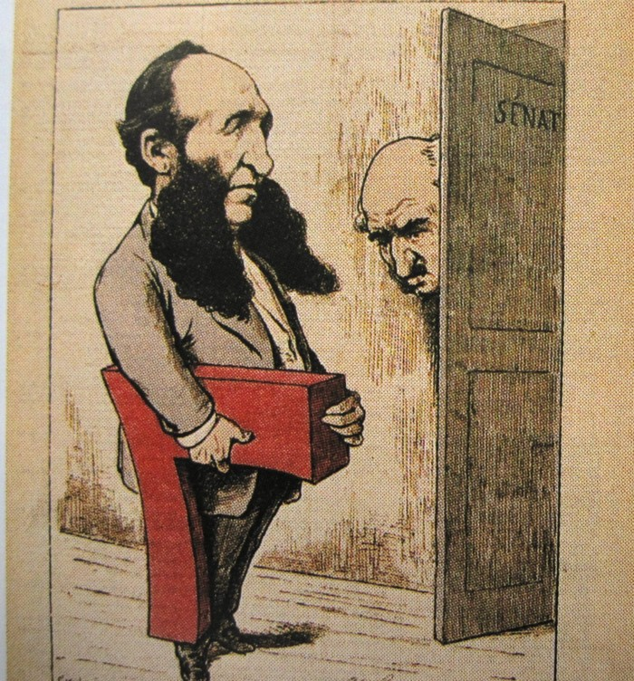

Après la loi de 1879 qui a permis la création de 64 Écoles Normales en 4 ans,
viennent celle de 1881 qui institue la gratuité et celle de 1882 qui rend
l’école obligatoire de 6 à 13 ans. L’école élémentaire va devoir accueillir 1
million et demi de nouveaux élèves. Il faut, le plus rapidement possible
construire des milliers d’écoles.

Heureusement, la Monarchie de juillet, par une loi de 1833 avait considéré que
le développement de l’instruction primaire exigeait que chaque commune ait un
local pour accueillir les enfants à scolariser.

Si les communes et les départements apportaient leur concours financier, l’État,
par une dotation annuelle, apportait la plus grande part des fonds. Cette
dotation, qui était de 60 000 F en 1830, était passée à 700 000 F en 18..   et à
plus d’un million l’année suivante. En 1842, 64 millions avaient été ainsi
dépensés pour les 10 200  écoles en état de fonctionner.

Cet effort très important permit de voir le nombre des écoles passer à 23 000 en
1847,  à 35 000 en 1860 et à 42 000 en 1874. Ainsi, en moins de 40 ans, le
nombre des écoles avait quadruplé.

De 1874 à 1885,  16 000 nouvelles écoles seront construites et plus de 30 000
restaurées et modernisées. De plus, il a fallu créer  les emplois d’instituteurs
et d’institutrices nécessaires pour accueillir tous ces enfants.

Sur le plan budgétaire, la IIIème république a dépensé 98 millions en 1889 pour
l’enseignement primaire contre 50 000 F sous la Restauration, 9 millions en 1869
et 27 millions en 1879.

D’autre part,  les salles d’asile ou écoles maternelles (on peut encore
distinguer la mention &laquo;&nbsp;Salle d’Asile&nbsp;&raquo; sur quelques
frontons d’écoles parisiennes - comme au 75 bd de Belleville) continuent à se
développer  et, en 1883, près de 700 000 jeunes enfants les fréquentent.

Charles Floquet, Président du Conseil en 1888 pouvait dire avec raison, que
l’œuvre accomplie  était &laquo;&nbsp;la plus glorieuse des tâches du
gouvernement&nbsp;&raquo;.

