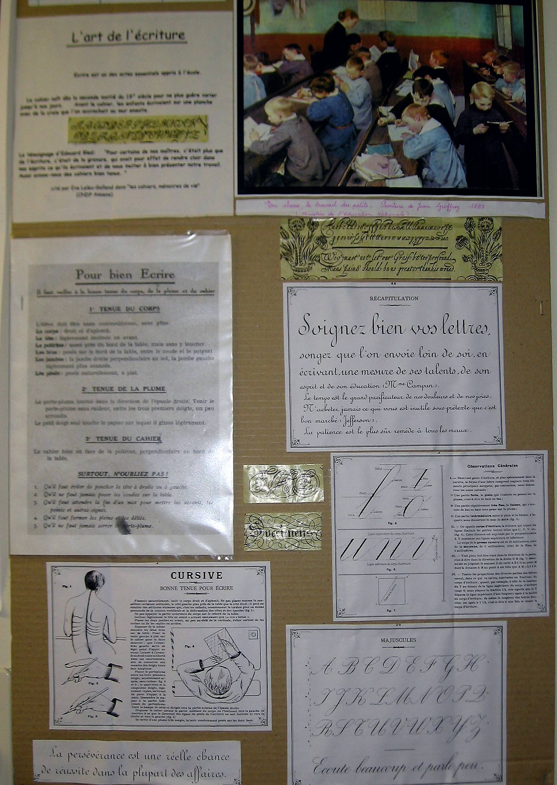

## Des conseils pour bien écrire

Pendant la leçon d'écriture, les intervenants expliquent aux enfants
comment se tenir et comment utiliser au mieux le porte-plume et l'encre.

### La position du corps :

Le corps doit être droit, la tête légèrement penchée, la main gauche maintient
le buvard et les pieds sont posés à plat sur le sol.

### La tenue du porte-plume :

Le porte-plume est dirigé vers l'épaule droite. On le tient sans raideur entre
les trois premiers doigts. Seul le petit doigt touche le cahier.

### L'utilisation de la plume :

Le bombé de la plume est tourné vers le plafond. Pour faire les **pleins**, la
plume appuie sur le papier et trace ainsi les lignes descendantes. La plume se
fait plus légère pour faire les **déliés** lors des lignes montantes.

Les explications historiques concernaient bien sûr et uniquement les élèves
droitiers. Les enfants gauchers avaient en effet l'interdiction d'utiliser leur
main gauche qui était, souvent, attachée dans le dos !

## Programmes officiels

La leçon d'écriture peut durer une vingtaine ou une trentaine de minutes selon
le souhait et la demande des enseignants.

Les feuilles « calligraphiées » par les enfants sont laissées, ensuite, à la
disposition des maîtres et maîtresses.