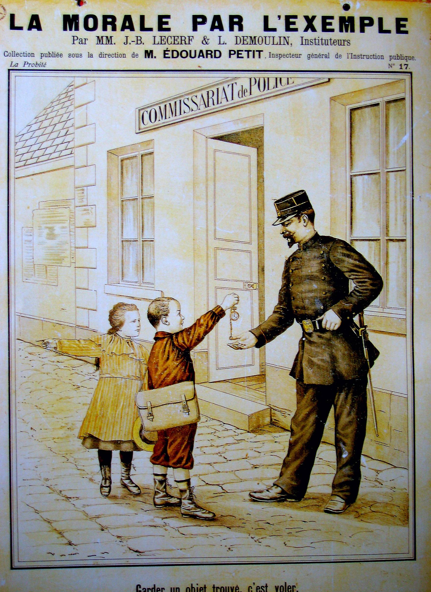
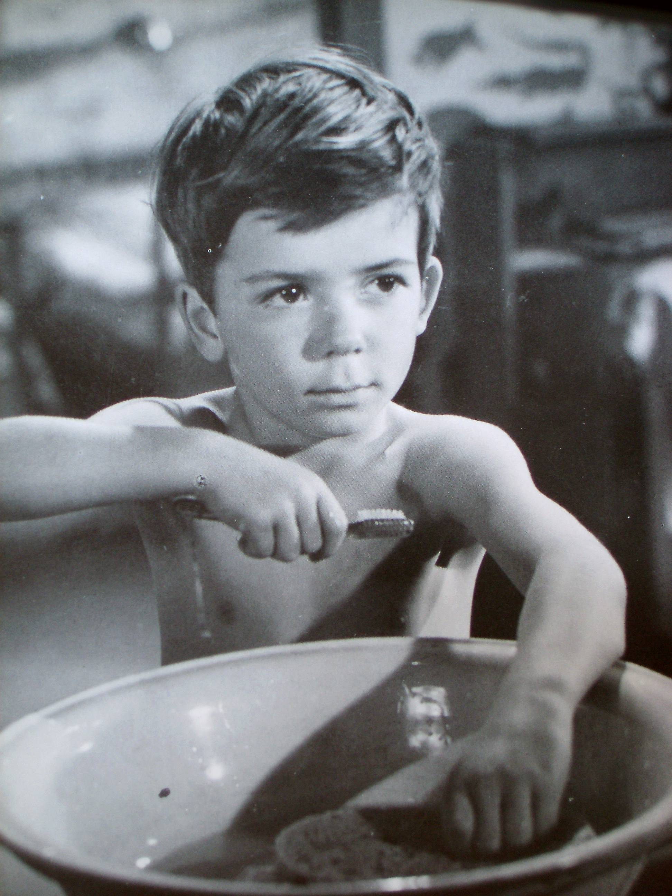
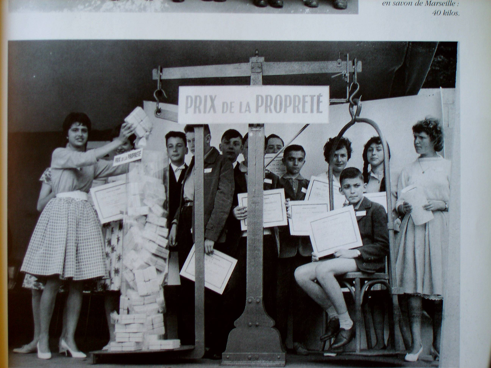

La classe d'autrefois se déroulait suivant un emploi du temps fixé dès le début
de l'année scolaire et qui était affiché en bonne place. L'écolier qui changeait
d'école n'était guère dépaysé car le décor des salles de classe et l'emploi du
temps variaient peu d'une région à l'autre.

La leçon de morale, systématiquement, commençait la journée. Dans sa lettre aux
enseignants, en 1885, Jules Ferry leur recommandait la plus grande prudence dans
leurs propos.

Au musée de l'école, le plus souvent, la maîtresse ou le maître qui accueille
les enfants leur propose une petite leçon de morale après avoir expliqué
brièvement ce que c'est que « la morale » ; en effet peu d'enfants sont capables
de donner la signification de ce mot. Le maître ou la maîtresse se sert d'un
court récit ou s'entretient avec les enfants sur le thême choisi qui porte, le
plus souvent, sur les bonnes pratiques de vie en société :

l'ordre et le soin, l'obéissance, l'écolier travailleur, attentif, le respect
des parents ou des maîtres, la politesse, le bon camarade etc... La petite
phrase qui illustre ou résume l'entretien est écrite au tableau :
- « Je prendrai grand soin de mes affaires »
- « J'écouterai toujours le maître »
- « Je serai un élève attentif » ...

Dans les écoles publiques, ces leçons de morale remplaçaient la prière du matin
dite dans les écoles religieuses. L'enseignement de la morale était aussi
présent à tout moment de la journée lorsque l'occasion se présentait. La leçon
de morale systématique a disparu des programmes dans les années 1971.

L'Instruction Civique complétait la morale pour que les élèves deviennent de
bons citoyens. Elle s'adressait surtout aux garçons puisque les femmes n'ont eu
le droit de vote qu'en 1944.
