Au 19ème siècle, on commence à équiper les écoles de véritables
pupitres.

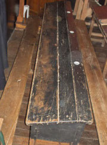

Le pupitre-type, vissé au sol, est constitué d'une longue planche
inclinée. Une rainure empêche les porte-plumes de tomber et des encriers
sont encastrés à la droite de chaque place. (Les enfants gauchers
utilisent obligatoirement leur main droite pour écrire). La planche est
solidaire d'un banc sans dossier pouvant accueillir de nombreux enfants
qui doivent l'enjamber pour s'asseoir.

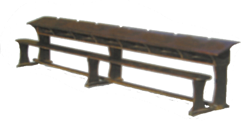

On trouve des
pupitres à 7 ou 8 places ou même à 12 places. Le maître passe alors
entre les pupitres pour surveiller le travail des élèves, immobilisés à
leur place.

Certains pupitres comportent des aménagements particuliers, suivant les
régions et les périodes de ce siècle :

Une feuille de schiste incrustée dans le bois sert d'ardoise.

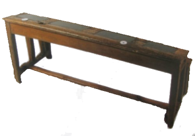

Un emplacement est prévu pour des bougies qui complètent ainsi
l'éclairage de la lampe à pétrole accrochée au plafond. Il y a en
général une bougie pour quatre enfants.

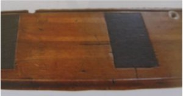

Une encoche pratiquée sur le devant de la table ou une planchette de bois fixée
sur le banc entre deux places, matérialise la séparation garçons-filles. Les
enfants entrent ou sortent d'un côté ou de l'autre suivant leur sexe. Ces
dispositifs seront supprimés vers 1920-1930.

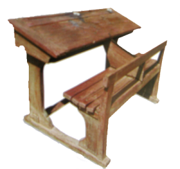

Un encrier supplémentaire, rempli d'encre rouge, est utilisé par le
maître venu corriger les travaux des enfants qui, eux, écrivent à
l'encre violette.

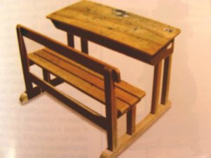

Des essais de mobilier spécifique et adapté témoignent de la nouvelle attention
portée à la santé des enfants dès le milieu du 19ème siècle. On craint la myopie
et la scoliose... En même temps que l'on recherche un meilleur éclairage, on
veille à éviter de mauvaises postures aux élèves. Les pupitres collectifs
disparaissent peu à peu, on voit apparaître des tables à 2 places (rarement
individuelles) avec dossiers et casier de rangement.

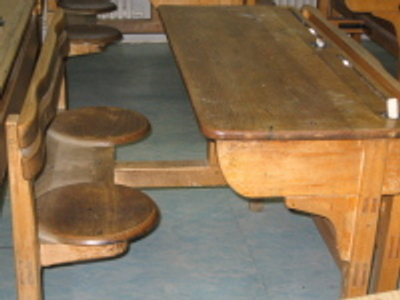

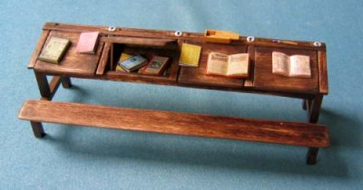

Le casier à abattant est fréquent. L'élève doit relever l'abattant pour prendre
ou ranger un objet et il est souvent tenté de le maintenir avec sa tête pour
avoir les mains libres. Ce système peu pratique et bruyant est très critiqué par
les enseignants.

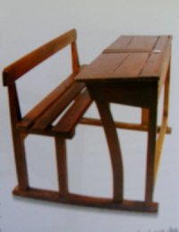

De plus en plus et jusqu'au milieu du 20ème siècle, on utilise les
pupitres à 2 places avec casier ouvert devant, face à l'élève.

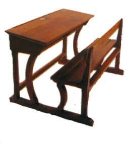

Ces mobiliers sont le plus souvent en chêne, assemblés en « queue d'aronde » et
très solides, ils voient passer de nombreuses générations d'écoliers. Ils ont,
en outre, l'avantage d'être très stables et de limiter le bruit lors de l'entrée
ou de la sortie des élèves. Le bois est ciré et chaque enfant doit, surtout en
fin d'année, le frotter au papier de verre pour enlever les taches d'encre. Le
bois présente alors souvent des creux, témoins de nombreux nettoyages !

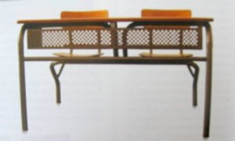

Au 20ème siècle, on voit apparaître des pupitres mi-bois mi-métal, toujours avec
table et chaises solidaires. On assiste aussi à quelques essais de pupitres
réglables en hauteur mais ces pupitres, peu pratiques, ne sont pas beaucoup
utilisés.

Jusque là, le mobilier traduit l'organisation rigide et statique de
l'enseignement dominé par l'ordre et la discipline. Vers le milieu du 20ème
siècle, on commence à changer de mentalité, à considérer que l'enfant doit être
mieux installé (vers 1950) ou qu'il faut lui permettre de bouger, de s'exprimer,
d'être plus actif en classe (1960-1970). Le mobilier scolaire suit alors ces
évolutions : C'est la fin des meubles fixes adaptés à un enseignement frontal.
C'est l'apparition des tables et des chaises séparées, les tables ne sont plus
vissées au sol. C'est aussi la disparition des pupitres inclinés, remplacés par
des plans horizontaux, des rainures retenant les crayons et maintenant stylos,
et quelquefois aussi des casiers de rangement. Le mobilier se veut alors
modulable et adaptable à des activités diversifiées, de groupes ou collectives.
La disposition de la salle de classe n'est plus immuable et, si l'on gagne en
mobilité, on perd peut-être en quiétude ! Les maîtres actuels peuvent témoigner
du bruit engendré par les chutes de stylos ou par les déplacements de tables ou
de chaises !
