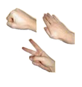
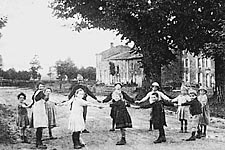
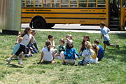
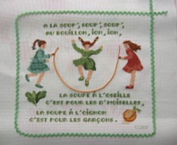
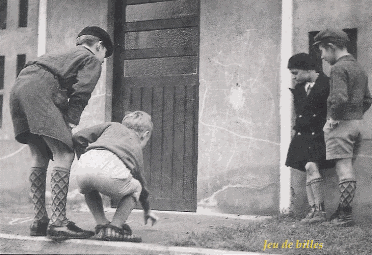
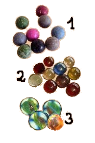
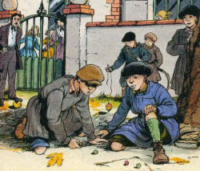
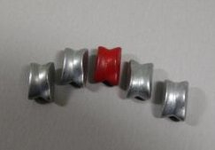

De tous temps, à l'école, les récréations étaient un moment privilégié réservé
aux jeux et permettaient aux enfants de se détendre mais aussi de se socialiser.
Les jeux variaient selon le sexe, l'âge, l'époque, la saison... On jouait à
deux, à trois, en petits ou en grands groupes, avec ou sans « matériel ». Ils
démarraient spontanément, sans meneur de jeu adulte (mais sous la surveillance
attentive du maître de service !).

## 1. Les jeux d'élimination

Souvent, avant de jouer, il fallait procéder au choix du premier joueur ou des
équipes. Pour cela , les enfants récitaient souvent une comptine dite
« d'élimination » :

-   Amstramgram, pique et pique et colégram, bourre et bourre et
    ratatam, amstramgram...

-   Plouf, plouf, ça sera toi qui.... mais comme le roi ne le veut pas,
    ça ne sera pas toi... et comme la reine a bien voulu, ça sera toi.

-   Un petit cochon, pendu au plafond...

Il existe aussi un jeu universel qui a servi, de tous temps et en de
nombreux pays, à éliminer ou choisir un joueur.

C'est le jeu
nommé « pierre-feuille-ciseaux » en France ou, ailleurs, chifoumi,
eau-feu-serpent, caillou-ciseaux-papier, serpent-grenouille-limace...

Il permet, grâce à des mouvements rapides de la main, de gagner ou de perdre et,
ainsi, éliminer quelqu'un. Ce jeu ne demande pas de réflexion, la pierre gagne
sur les ciseaux (écrasement), qui, eux-mêmes, gagnent sur la feuille (découpe),
qui, elle-même, gagne sur la pierre (enveloppement).

## 2. Les rondes enfantines

Les petites filles ont toujours aimé faire des rondes.

Elles se tenaient par la main et tournaient en chantant une comptine.

-   « Passe, passe passera, la dernière, la dernière, passe, passe, passera, la
    dernière restera... » : les enfants faisaient un tunnel en se tenant par
    les mains, deux par deux et chaque groupe de deux passait dans le tunnel en
    évitant de se faire « prendre » à la fin de la comptine.

-   « Le fermier dans son pré, le fermier dans son pré, ohé ohé ohé... »la
    petite fille choisie pour être « le fermier » choisissait à son tour « sa
    femme », « son enfant », « la nourrice »,« le chien », « le chat », « la
    souris » et enfin, « le fromage » qui était battu par toutes, au milieu de
    la ronde.

-   « Tiens, voilà main droite, tiens, voilà main gauche... », un jeu de
    rapidité avec les mains, qui se jouait deux à deux.

-   « Si tu veux faire mon bonheur, (prénom de l'enfant mis au centre de la
    ronde), si tu veux faire mon bonheur, (prénom) donne-moi ton cœur... dis-moi
    oui, dis-moi non... » L'enfant devait alors choisir un autre enfant dans le
    cercle (ou, souvent, les fillettes choisissaient un garçon de l'école d'à
    côté !)

-   « Dansons la capucine, y'a pas de pain chez nous, y'en a chez la voisine,
    mais ce n'est pas pour nous... »

## 3. Les jeux collectifs

Les plus traditionnels étaient :
-   « Chat », « Chat perché », « Chat- stop »...
-   « Cache-cache »,peut-être un peu difficile dans une cour de
    récréation où il n'y avait pas beaucoup de cachettes 

    

-   « Chandelle » jeu international, appelé aussi « jeu du mouchoir »,
    « rag-tag » ou « duck-goose », dans les pays anglo-saxons.

-   « Déli-délo », une variante du jeu de « chat », joué en 2 équipes. Les
    prisonniers faisant une chaîne pouvaient être délivrés par les joueurs de
    leur équipe.

-   « Un, deux, trois, soleil », plutôt joué entre filles. Une fille face à un
    mur, comptait : « un, deux, trois, soleil » puis se retournait. Pendant
    qu'elle comptait, ses camarades , placées assez loin d'elle, se
    rapprochaient en prenant soin de ne plus bouger après le mot « soleil ». Le
    but était d'arriver au mur sans avoir été vue en mouvement.

-   « Quatre coins » : Un jeu également présent dans beaucoup d'autres pays.
    Cinq joueurs, dont quatre adossés à quatre arbres et un au milieu. Les
    quatre enfants devaient échanger leurs places sans que le cinquième en
    prenne une.

-   Et, bien sûr, tous les jeux de ballon, foot, basket ou jeux libres. Jadis,
    les ballons n'étaient pas interdits dans les cours de récréation !

## 4. Les jeux de filles

### Les marelles

Ce jeu a des origines très anciennes. On a pu en retrouver la trace dans le
monde antique, en Egypte et à Rome, et dans de nombreux sites des 14ème et 15ème
siècles. En vieux français, le mot « mérel » ou « méreau » désignait un palet de
pierre ou une grosse médaille ou monnaie. Le mot a désigné ensuite le dessin
puis le jeu. Les formes de marelles ont varié selon les époques mais, quelle
qu'ait été sa forme, la marelle comportait une « terre » (départ) et un « ciel »
(arrivée). C'était un parcours un peu initiatique, de la naissance (terre) à la
mort (paradis).

Au siècle dernier, le palet était bien souvent remplacé par une boîte métallique
(pastilles Pullmoll, réglisse Florent). Cette boîte était lancée, tour à tour
dans toutes les cases de la marelle et l'enfant devait faire le parcours en
sautant à cloche-pied en évitant de marcher dans la case de la boîte et sur les
lignes. Trois sortes de marelles « fleurissaient » alors sur le sol des cours
d'écoles de filles :

-   « la marelle droite » ou « marelle à 6 » : Les fillettes devaient
    parcourir les 6 cases de la marelle en poussant la boîte avec le
    pied.

-   « la marelle ronde » ou « marelle escargot ». La terre était le
    départ et le ciel, l'arrivée mais bien souvent, les fillettes ne
    dessinaient pas la terre.

-   « la marelle avion » : C'est la plus répandue, actuellement, dans le
    monde. On la retrouve sur tous les continents. Sa forme primitive,
    en croix, d'inspiration religieuse, a évolué et elle a pris sa forme
    et son nom actuels au début du 20ème siècle.

Ce jeu se pratiquait à 2, 3 ou 4 joueuses. Les plus habiles pouvaient, en cas de
réussite, se réserver des « royaumes », dans la marelle même ou dans les parties
« ciel » ou « terre ». Ces territoires, interdits aux adversaires, leur
compliquaient bien la tâche !

### La corde à sauter

Les filles ont toujours beaucoup aimé sauter à la corde pendant les récréations.
Les enfants pouvaient jouer seules ou à plusieurs, deux enfants faisant alors
tourner la corde pendant que d'autres sautaient. Quequefois, une seule enfant
tournait sur elle-même, la corde tendue devant elle, et les autres fillettes
devaient sauter au passage de la corde. Il existait aussi une variante beaucoup
plus difficile pratiquée avec deux cordes.

Souvent, pendant le jeu collectif, les fillettes chantaient une comptine en
rythme avec les sauts : « A la soupe, soupe, soupe, au bouillon, yon, yon, la
soupe à l'oseille, c'est pour les d'moiselles, la soupe à l'oignon, c'est pour
les garçons ».

## 5. Les jeux de garçons

### Les billes

L'origine du jeu de billes reste inconnue. La première apparition connue semble
remonter à la Grèce antique où l'on pratiquait la « troppa » ; le but du jeu
était de lancer un maximum de petits objets ronds dans un trou. Pareillement,
les Romains jouaient à « l'orca », jeu où il fallait lancer des noix ou des
noisettes dans un vase.

Entre le Moyen Âge et la Renaissance, la bille, qui était jusqu'alors un objet
naturel, devient un objet artisanal. Les billes sont faites en bois ou en métal,
de forme grossièrement sphérique, elles sont alors appelées
« gobilles ».Certains maîtres verriers vénitiens ont même fabriqué des billes de
verre au milieu du 14ème siècle.Toutefois, malgré cette évolution progressive de
la bille, ce n'est qu'au 15ème siècle que les jeux s'organisent et que les
règles se mettent en place, de façon orale.

Le 18ème siècle voit se développer un intérêt croissant pour les jeux et les
jouets. Les billes s'arrondissent parfaitement. Les matériaux de fabrication,
quant à eux, se multiplient. Au début du 20ème siècle, on trouvait des billes le
plus souvent en terre peinte (photo 1), mais parfois, aussi, en verre (photo 2),
en métal, en porcelaine, ou en agate (photo 3). Les « cales », un peu plus
grosses et le plus souvent en verre, valaient plusieurs billes.

Il y avait, au début du siècle, de nombreuses façons de jouer aux billes. Le but
était toujours de viser et toucher une cible afin de gagner un objet (soldat en
plomb ou en plastique) ou d'autres billes. Les divers jeux portent des noms
variés à l'infini : poursuite, tique, cercle,tique et pat, enclos... On jouait
au milieu de la cour ou contre un mur suivant les règles choisies par les
enfants.

Ce jeu était extrèmement populaire et les poches des écoliers étaient
constamment alourdies par des billes de toutes sortes, et, quand l'enfant était
habile, par des « calots », billes de verre ou d'agate de très grosse taille.

### Les osselets

Le jeu se jouait avec de petits os de forme particulière (carpe du très jeune
mouton ou du porc), permettant de les glisser à la racine des doigts. C'était un
jeu très populaire en Grèce antique. Au siècle dernier, les garçons ne jouaient
plus avec de vrais osselets, mais avec des copies en métal ou en plastique, plus
petits, et donc plus faciles à manipuler pour eux mais dont le poids (trop léger
pour le plastique) et la surface trop lisse n'aidaient pas à accomplir les
figures compliquées.

La règle de base du jeu était simple :

-   lancer un osselet en l'air (en général « le père ») ;

-   ramasser un osselet parmi ceux posés par terre ;

-   rattraper « le père » avant qu'il ne touche le sol.

Le jeu devenait ensuite difficile, voire très difficile, quand il fallait
ramasser plusieurs osselets en même temps, les tenir sur le dos de la main,
rattraper le « père » en un mouvement particulier (patte de chat, balayette...),
maintenir les osselets entre les doigts (tête de mort) en faisant les figures...
Certains enfants étaient des « as » à ce jeu et gagnaient ainsi une grande
popularité auprès de leurs camarades !
