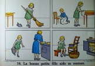
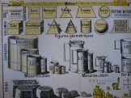
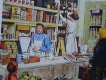
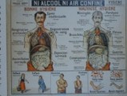
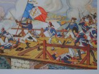
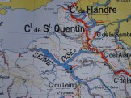

En deux ou trois images qui racontent une histoire, la leçon de morale
s'affiche. La gravure restera quelques jours et permettra au maître de
vérifier à la fin de la semaine que les préceptes de bonne vie en
société sont bien acquis.

Au cours préparatoire, les tableaux de lecture montrent la progression
dans les apprentissages et sont aussi des modèles pour l'écriture car
dans le temps où l'on apprend à lire on apprend aussi à écrire en script
ou en écriture anglaise droite ou penchée..

Les tableaux de calcul rappellent tout le système métrique et les
mesures de longueur, de surface et de volume ainsi que leurs rapports
entre elles : un cube de 1 décimètre d'arête contient un litre d'eau et
ce litre d'eau pèse un kilogramme...

D'autres affiches aident à comprendre et à retenir les difficiles règles
d'orthographe et les tableaux de conjugaison peuvent parfois éviter
quelques fautes dans les dictées hebdomadaires.

Les tableaux de vocabulaire et d'élocution sont utilisés par le maître
pour faire parler les enfants sur des scènes et des lieux de la vie
courante : le magasin de l'épicier, aux sports d'hiver, on construit une
maison, les vendanges etc .. et leur faire découvrir des mots nouveaux
ou le sens exact de certaines expressions.

Et puis les enfants peuvent s'étonner en regardant les tableaux de
sciences naturelles affichant, en couleurs, plantes, animaux et homme

et même on peut voir ce qu'il y a à l'intérieur du corps !!!!

On peut rêver en voyant les gravures de géographie montrant la carte de
la France ou de pays lointains et les images représentant les grands
évènements historiques : Bonaparte au pont d'Arcole, les soldats dans
une tranchée pendant la guerre de 1914 ou l'assassinat du roi Henri IV .

On affiche aussi, quand on les possède, les dessins faits par Benjamin
Rabier racontant les fables de Jean de la Fontaine.

Près du bureau du maître sont disposés les tableaux réglementaires que
Monsieur l'Inspecteur examinera lors d'une de ses visites : les
répartitions mensuelles, l'emploi du temps, la liste des chants appris
et des récitations étudiées, la pyramide des âges

Ainsi le mur de la classe devient la mémoire collective de tout ce que
l'on doit apprendre et retenir et joue son rôle même quand le regard de
l'enfant s'évade sur les affiches colorées.
