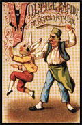
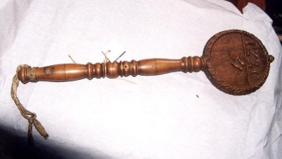
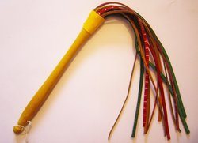
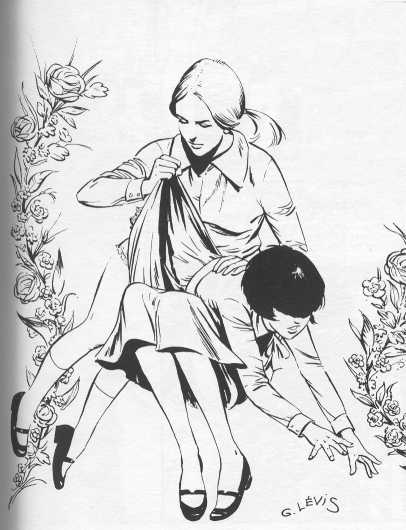
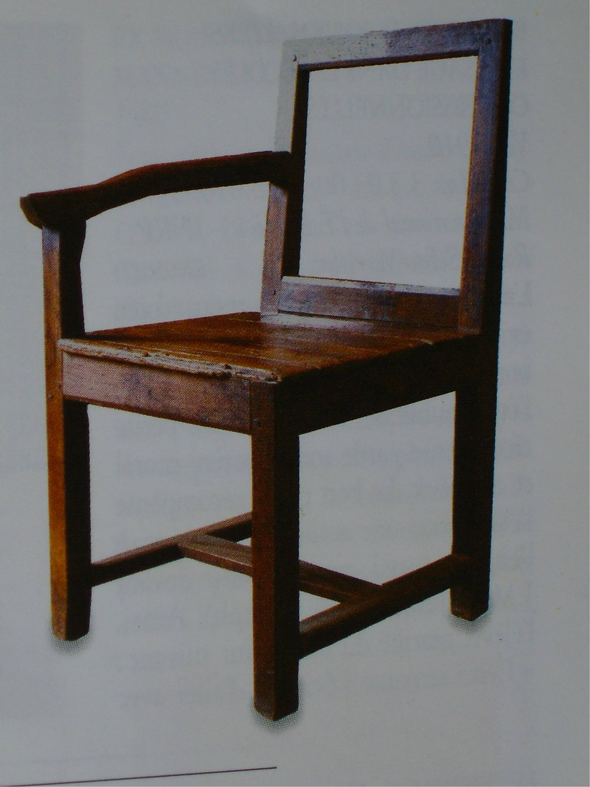
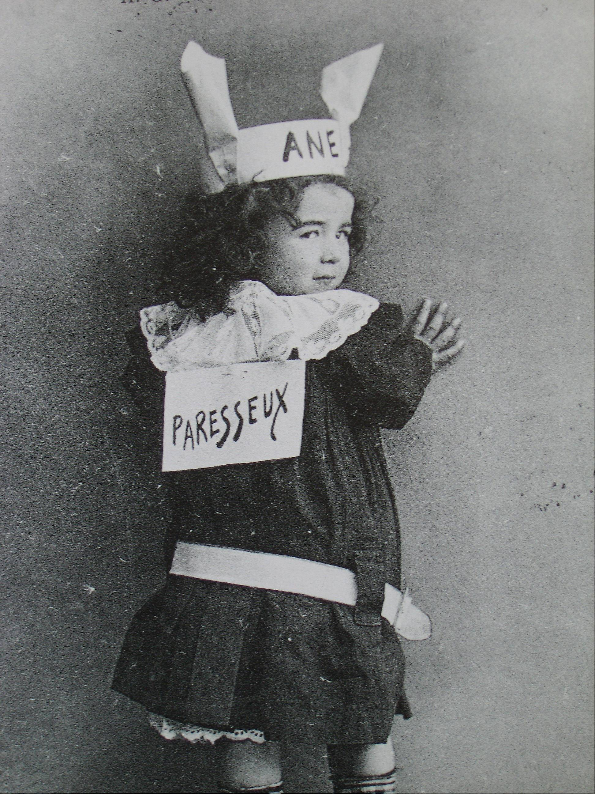
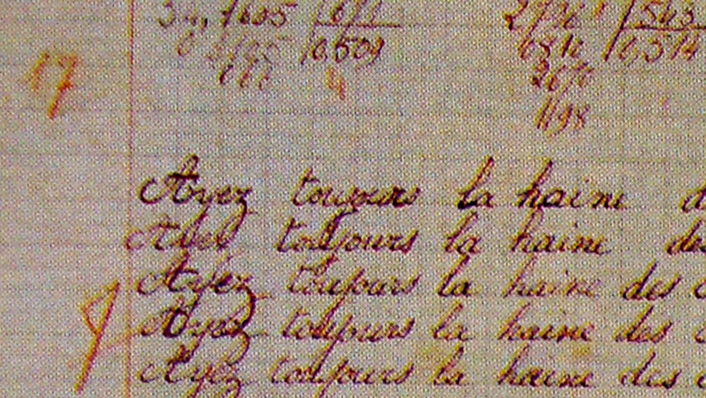

Depuis la plus haute antiquité, les punitions corporelles ont toujours
été jugées nécessaires pour dresser une enfance forcément paresseuse et
indisciplinée : les Egyptiens ne disaient-ils pas que les enfants
avaient des oreilles dans le bas du dos !!

Au 16ème siècle, la liste des punitions est soigneusement graduée selon
la faute de l'élève : on recommande comme punition mineure le coup de
baguette sur les doigts puis viennent les verges ou le martinet sur les
mains puis sur le « derrière ». Pour une faute plus grave, ce sera le
« cabinet noir » pour une durée de 6 heures au maximum et en cinquième
position dans l'échelle des sanctions « l'habit de l'âne ou le bonnet
d'âne. L'élève ainsi sanctionné peut être amené à revêtir l'habit de
l'âne et même à être conduit à la porte de l'école pour être hué par
l'ensemble des écoliers. »Le bonnet d'âne\" est une punition qui a
existé dès l'antiquité et a fortement marqué les esprits bien qu'il ait
été peu utilisé et l'abondante iconographie sur ce sujet ne correspond
pas à la réalité. Par contre, l'envoi dans les autres classes d'un élève
dont le travail était négligé ou mal présenté avec le cahier accroché
dans le dos a été une punition très utilisée dans les années 50/60.

Au moyen âge, la punition corporelle donnée au moyen de verges ou avec
la férule était fréquente.

Jusqu'à la fin du 19ème siècle, la fessée était encore en usage dans
certaines écoles puisque le musée pédagogique de Haute Saône possède une
chaise « à fesser ».

La fessée, qui a toujours été interdite, a cependant existé de tous temps.
L'arrêté de janvier 1887 dresse la liste des seules punitions que les maîtres
peuvent utiliser : il s'agit des mauvais points, des réprimandes, de la
privation partielle de récréation, de la retenue après la classe et de
l'exclusion de trois jours au plus. L'arrêté précise qu'il est absolument
interdit aux maîtres d'infliger aux enfants des punitions corporelles.

A l'opposé des bons points et des images, il y avait les mauvaises
notes : ces petits bâtons, mis bout à bout en regard du nom de l'élève
frondeur, dissipé ou inattentif sur le cahier de conduite du maître
faisaient que la note de conduite, transmise aux parents à chaque fin de
semaine, pouvait s'approcher du Zéro, ce qui entraînait d'autres ennuis
quand il était rapporté à la maison.

Une bêtise en classe ou un travail non fait pouvait avoir pour
conséquence l'envoi « au coin » ou au « piquet ».

Comme son nom l'indique, l'élève au coin était envoyé dans un angle de
la classe, la face tournée vers le mur et les mains au dos ou, peine
aggravée, les mains sur la tête.. Le piquet, sans doute par analogie à
la chèvre qui était attachée à un pieu et ne pouvait aller où elle
voulait était la punition infligée à un élève en dehors de la classe et
qui devait rester en un certain lieu, souvent dans le préau, pendant que
ses camarades étaient en récréation ou qu'ils rentraient chez eux, la
classe terminée.

La punition écrite consistait souvent à faire des « lignes », c'est à dire à
écrire un certain nombre de fois la même phrase, souvent moralisatrice : « Je
dois être poli avec le maître », « Je ne serai pas brutal avec mes camarades »
...

Certains punis, adroits, réussissaient à écrire avec deux crayons à la
fois ce qui diminuait de moitié la longueur de la punition.\
Celui qui vous parle a eu, à 8 ans et demi, 500 lignes à faire pour
avoir fait rouler une bille dans la rainure de la table et il n'était
pas question, pour les parents, de demander un allègement de la
punition.

Il ne faut pas trop noircir le tableau : l'immense majorité des maîtres
ont peu eu recours à tout cet arsenal de punitions mais leur
responsabilité était grande ; l'école a toujours été l'outil de la
promotion sociale et les enseignants ont toujours eu à cœur de voir leur
élèves réussir. Ce n'était pas aisé avec des classes de 40 ou 50
élèves !
