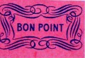
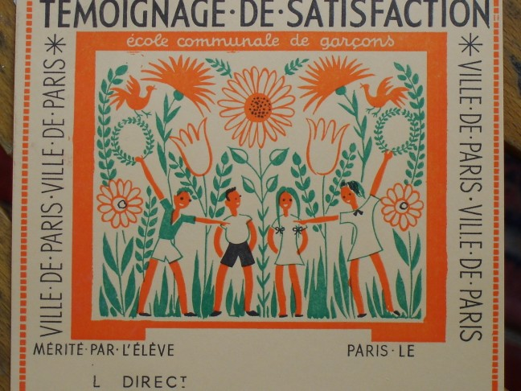
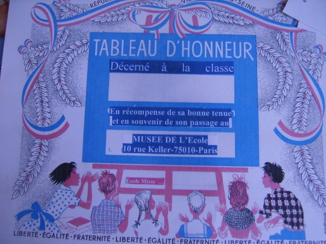
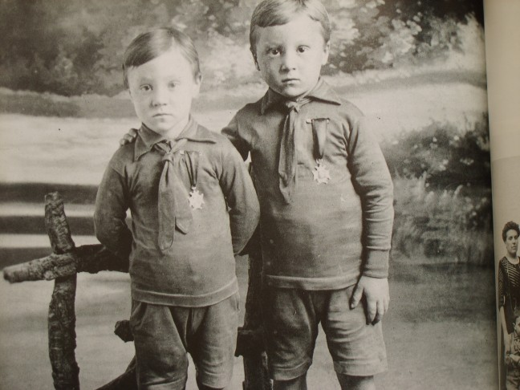

Les bons points étaient difficilement gagnés mais très facilement repris. Avec
parcimonie, le maître récompensait l'élève qui avait bien répondu ou bien
travaillé mais reprenait un, deux ou trois bons points si le comportement en
classe n'était pas satisfaisant ou si les résultats n'étaient pas ce que le
maître en attendait Glanés difficilement un à un, les bons points étaient
soigneusement gardés, comptés et recomptés jusqu'au moment où le total de dix
étant atteint, l'heureux possesseur pouvait demander au maître de les échanger
contre une image.

Les séries d'images avaient, le plus souvent, un but éducatif : les animaux,
avec un court commentaire résumant leur habitat ou leur mode de vie, les
paysages, les images à caractère historique, les activités humaines etc.

Les bons points sont repris par le maître qui les redistribuera aux
enfants méritants ; alors, bien sûr, peu à peu, les bons points
« s'usent » et il faut que le maître achète de nouvelles planches qu'il
faudra découper.

Lorsque, à force de travail et de sagesse, un élève a accumulé cinq ou
dix images, il a le droit d'aller frapper à la porte du bureau de
Monsieur le Directeur qui lui remettra un « Témoignage de satisfaction »
sur lequel auront été portés le nom et le prénom de l'enfant et que le
Directeur aura signé.

A la remise des livrets de notes, le plus souvent à la fin de chaque
mois, les meilleurs élèves sont inscrits au « **Tableau d'honneur** ». A
l'origine, il s'agissait d'un tableau, placé dans le hall d'entrée de
l'école et sur lequel étaient inscrits les noms des enfants à
récompenser.

Au Collège ou au Lycée, où ce système a perduré longtemps, on trouvait
les élèves qui étaient inscrits au tableau d'honneur, à un degré
supérieur, ceux qui avaient droit aux encouragements et enfin ceux qui
avaient mérité les félicitations qui étaient données par le Conseil des
Professeurs en présence de Monsieur le Proviseur.

Dans les écoles élémentaires, jusque vers les années 50, à chaque fin de semaine
la croix d'honneur ou de mérite était épinglée sur la poitrine de l'élève qui
avait obtenu les meilleurs résultats. L'enfant gardait la croix du mérite
jusqu'à la fin de la semaine suivante et la croix était alors remise à un
nouveau lauréat qui rapportait fièrement dans sa famille la preuve de ses bons
résultats.
