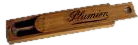
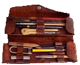
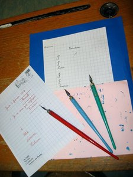
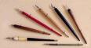
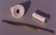
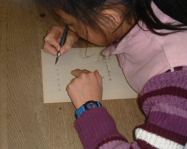
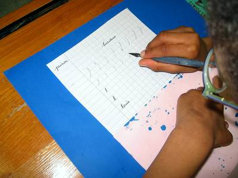

Il y a bien longtemps, nos ancêtres écrivaient avec des plumes d'oie et
de l'encre.

Puis, à l'école, des générations d'enfants ont appris à faire les pleins
et les déliés avec le porte-plume et les plumes Sergent-Major.

Le matin, les enfants sortaient leur plumier, ou, pour les plus chanceux, leur
trousse, et la leçon d'écriture commençait. Que de ratures, de pâtés, de mains
noircies et de taches sur les blouses !

Pourtant, après de nombreux efforts et de non moins nombreux conseils du
maître, les petits écoliers progressaient et même pouvaient écrire de
très belles pages calligraphiées ! Combien d'enfants de 2008 en sont à
présent capables ?

Le musée présente une belle collection de plumes et de porte-plumes,
ainsi que des cahiers d'élèves où l'on peut constater l'application et
la dextérité des enfants de l'époque.

Pendant la visite du musée, les enfants apprennent à tenir le
porte-plume, à immobiliser leur feuille et leur buvard et à tracer
quelques lettres ou mots simples. Ceci leur montre qu'il est bien plus
facile d'écrire avec un stylo qui pardonne les mauvaises positions et
que leurs grands-parents ou arrière grands-parents avaient bien du
mérite !

Les enfants que nous recevons au musée adorent les leçons d'écriture et
font beaucoup d'efforts pour bien écrire. Les enseignants et les parents
d'élèves ne sont pas les moins enthousiastes !
