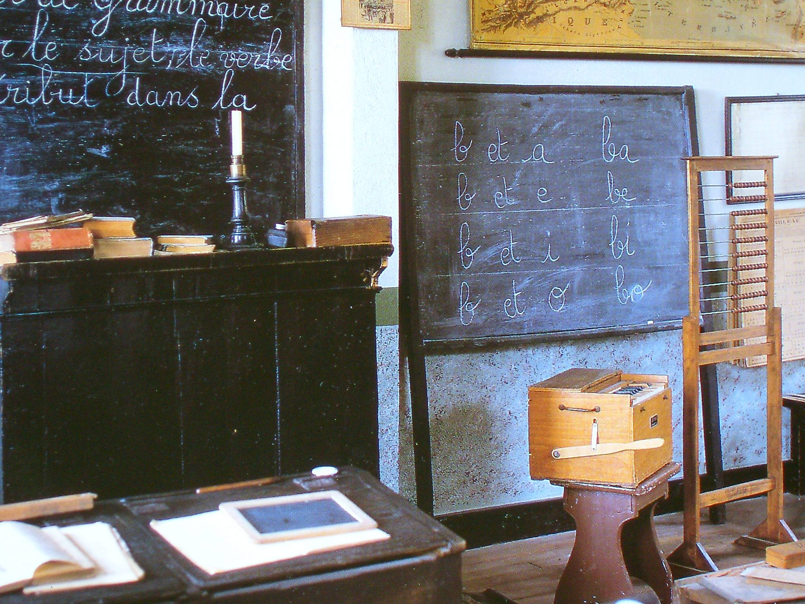
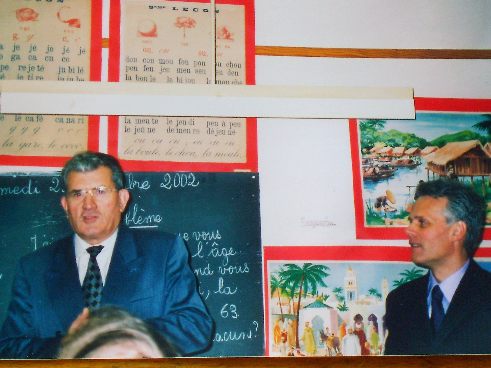
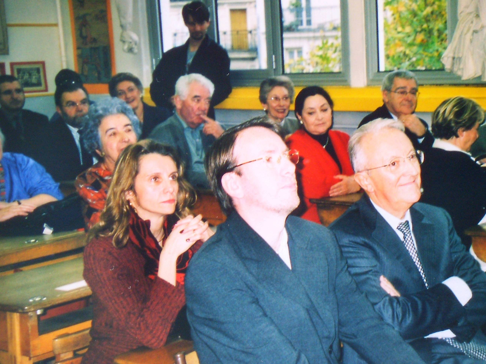
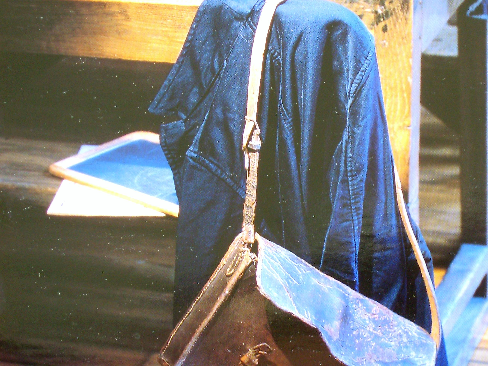

L'idée a germé en 1997. A l'heure de la retraite, il m'a semblé qu'il était
nécessaire de protéger et de sauvegarder un patrimoine qui, compte tenu de
l'évolution des techniques, allait devenir à très brève échéance, totalement
obsolète et disparaître au fond des armoires ou au fond des caves, quand ce
n'est pas directement à la poubelle.

J'ai trouvé en Gilbert Martino, à cette époque directeur de l'école mixte, 10
rue Keller, un collègue et ami intéressé par cette entreprise de sauvegarde et
qui pouvait, compte tenu de l'importance des locaux de son école, accueillir un
musée scolaire.

Une association loi 1901, « ***il était une fois l'école*** », fut créée en 2000
et Gilbert Martino en devint le Président.

La Direction des Affaires Scolaires de Paris, en la personne de Monsieur Eric
Ferrand, Maire adjoint de Paris chargé des questions scolaires et périscolaires
et de Monsieur Jean Pierre Boulay, Chef de la Circonscription administrative
scolaire et la Mairie du XIème arrondissement, en la personne de Monsieur
Georges Sarre, Maire et de Monsieur Lévèque, directeur de la Caisse des écoles,
ainsi que les services de l'Education Nationale représentés par Monsieur Prévost
et Monsieur Champeyrache, inspecteurs de l'Education Nationale, nous ont
considérablement aidés à résoudre les problèmes administratifs et financiers
posés par cette création.

Les objets représentatifs de l'école de la première moitié du 20ème siècle et
les documents furent donnés par des écoles et par des donateurs privés.
L'inauguration du musée, en présence de Monsieur G. Sarre, maire du XIème
arrondissement eut lieu le 1er décembre 2003.

Depuis cette date, le musée a pu s'agrandir et s'enrichir. Il comporte
aujourd'hui trois salles et un bureau pour la gestion. La première salle est la
reconstitution d'une classe des années 1950. Dans la seconde salle sont
regroupés des matériels et des documents se rapportant à l'enseignement de
l'histoire et de la géographie, aux sciences, aux récompenses, à la reprographie
et à l'informatique. La troisième salle est plus spécialement réservée à la
documentation pédagogique pour les maîtres et à l'audiovisuel avec projecteur de
diapositives téléviseur, magnétoscope, lecteur de DVD etc...

Ce musée n'est pas un lieu fermé servant d'entrepôt à des objets
scolaires d'un autre temps, mais il se veut un endroit vivant, ouvert,
en particulier, aux enfants des écoles élémentaires et des collèges.

