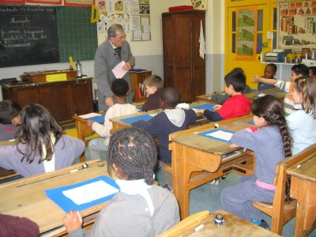

Le musée est ouvert aux classes pour des visites pédagogiques, le lundi, le
mardi, le mercredi matin, le jeudi et le vendredi, de 9h à 11h et de 14h à 16h.
Prix de la visite : 30€ par classe.

 

- Le musée est installé au troisième étage de\
l'école mixte\
4-10 rue Keller\
75011 Paris\
[Plan](https://www.google.com/maps/place/4+Rue+Keller,+75011+Paris,+France)

- Pour visiter, contacter notre secrétaire, responsable des plannings :\
Mme Jocelyne Beffara\
email : [jocelyne@beffara.org](mailto:jocelyne@beffara.org)

- Pour toute autre raison, contacter notre présidente :\
Mme Michelle Leprévost\
email : [mic.leprevost@noos.fr](mailto:mic.leprevost@noos.fr)

## À noter !

Appel aux jeunes retraité(e)s de l'Education Nationale !

Vous étiez Professeur des Ecoles et vous êtes passionné(e) par l'Histoire de
l'Ecole ? Si vous voulez rejoindre notre équipe, contactez-nous. Une animation
en face d'une classe puis une réunion d'accueil vous permettront de vous
familiariser avec notre action ! Qu'on se le dise !
