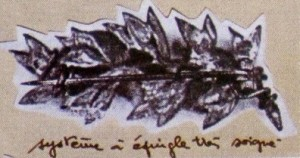

Se présenter au « Certif » n'était pas obligatoire mais quelle fierté pour les
élèves reçus et pour leurs parents.

Le précieux diplôme, sur lequel étaient inscrits le nom, le prénom, la date de
naissance, le lieu de naissance et l'adresse du lauréat, prouvait que le
récipiendaire savait lire, écrire et compter mais aussi qu'il avait des
connaissances en histoire et en géographie. Sa réussite montrait aussi qu'il
avait compris et appris les valeurs de la morale républicaine que les maîtres et
les maîtresses lui avaient enseignées tout au long de sa scolarité.

Le certificat d'études contrôlait tout ce qui avait été enseigné dans l'année
avec, bien sûr, en priorité, le français, le calcul, l'histoire, la géographie
et les leçons de choses mais aussi le dessin, la couture, le travail manuel
etc...

La première partie de l'examen portait sur le français et le calcul. La dictée
comprenait 25 lignes mais au vu du nombre des éliminés avec 8 fautes elle fut
rapidement ramenée à 15 lignes. Elle servait aussi à noter l'écriture.

Les deux questions de calcul portaient souvent sur des problèmes de vie
pratique. Sauriez-vous résoudre ce petit problème proposé aux enfants en 1890 :
« Quand un élève est premier, son père lui remet 5 F mais chaque fois qu'il
n'est pas premier, il rend 2 F à son père. Au bout de 21 devoirs, l'enfant
possède 70 F . Combien de fois a-t-il été premier ? »

La deuxième partie de l'examen, orale cette fois, permettait, en moins d'une
demi-heure, d'apprécier les connaissances de l'élève en lecture expliquée,
récitation, histoire et géographie.

Les heureux lauréats recevaient souvent un livret de Caisse d'Epargne avec un
crédit de 10 Francs. J'ai retrouvé, dans mon école parisienne, une cinquantaine
de ces livrets qui n'avaient pas été réclamés par leurs propriétaires et dont
les crédits ont été reversés dans le pot commun des Caisses d'Epargne.

A partir de 1895 furent créés, soit dans l'école élémentaire soit dans bâtiments
spécialement construits, des écoles primaires supérieures qui permettaient aux
élèves, après trois ans d'études complémentaires d'obtenir un Certificat
d'Etudes primaires portant mention« d'Etudes complémentaires ».

Un représentant local des autorités municipales ou militaires local, Maire ou
Conseiller Municipal, portant le titre de « Commissaire » assistait à la remise
des prix récompensant les élèves reçus. Sur le revers de sa veste était apposée
une « broche » de commissaire.

Les candidats devaient parfois répondre à des questions embarrassantes :
- « Expliquez pourquoi on souffle sur les doigts pour les réchauffer et sur la
  soupe pour la refroidir. »
- « Quel est le département qui comporte le plus de sous-préfectures ? »
- « Quelle est la différence entre un foudre et la foudre ? »

Ceux qui avaient quitté l'école sans obtenir le précieux parchemin par suite
d'un parcours scolaire écourté ou un échec lors de l'examen pouvaient se
présenter à la session pour adultes après avoir suivi des cours de rattrapage.
Le Certificat d'études ou C.E.P. était, en effet, exigé pour postuler à un
emploi public comme agent des écoles, garçon de bureau, etc.

Avec la prolongation de la scolarité et l'entrée de pratiquement tous les élèves
dans le cycle secondaire, l'intérêt d'obtenir le C.E.P. a diminué au bénéfice du
Brevet Elémentaire passé en classe de troisième des collèges. Cependant, jusqu'à
la fin des années 70, chaque année, des instituteurs et des directeurs d'école
étaient mobilisés pour corriger les épreuves ou faire partie des jurys.

Autres temps, autres mœurs : les enfants d'aujourd'hui savent des choses que les
enfants d'hier ne savaient pas, mais je ne suis pas sûr que les enfants
d'aujourd'hui sauraient toujours déjouer les pièges posés par les maîtres de
jadis en mathématiques et en français.
