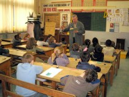
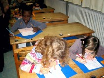

Le rendez-vous doit être obligatoirement pris auprès de Madame Beffara (voir ses
coordonnées dans la rubrique « Renseignements pratiques »). La séquence est
généralement de 2 heures (de 9h à 11h ou de 14h à 16 h). La visite est encadrée
par deux intervenants de l'association.

Chaque visite est axée principalement sur des activités pédagogiques et
la visite, d'une durée variable, des salles du musée.

À leur arrivée, les enfants sont mis en condition : ils deviennent des élèves
des années 1950/1960. Avant d'entrer dans la salle de classe, on rappelle la fin
des récréations, les mises en rang... On commence soit par la visite du musée,
soit par des séquences pédagogiques souhaitées par le maître de la classe.

Deux exercices sont toujours proposés : la leçon de morale ou la causerie sur
l'école d'autrefois et la leçon d'écriture, à l'encre avec la plume en acier.

Si l'horaire le permet, on propose une leçon de calcul mental en mettant en
œuvre le procédé « La Martinière ». Les bons points à la marque du musée,
généreusement attribués, sont très appréciés.

La visite du Musée, d'une longueur variable, se fait par demi groupe classe, les
intervenants étant toujours au moins deux. Des DVD proposant des images de
situations diverses ou d'objets scolaires maintenant disparus terminent la
visite si le temps ne manque pas.

La durée de la visite varie, selon le temps dont dispose la classe, de
1h30 à 2 heures mais l'idéal est de pouvoir effectuer deux visites pour
exploiter au mieux les richesses du Musée.
